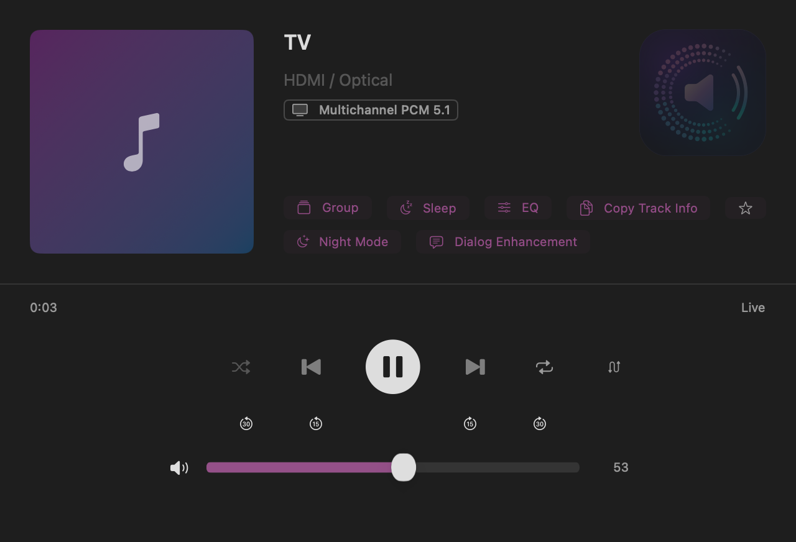
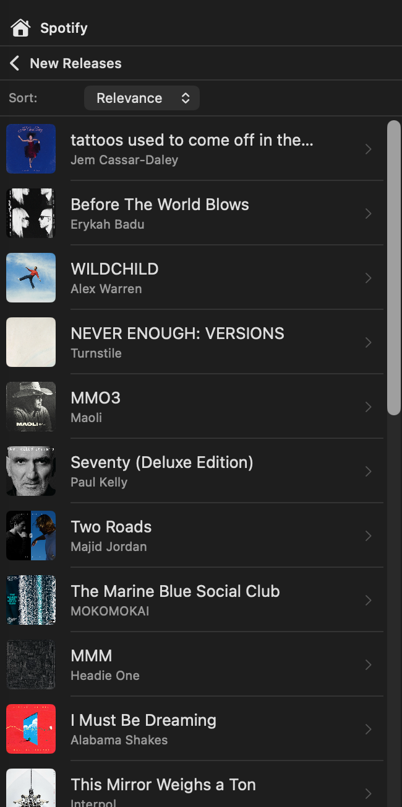
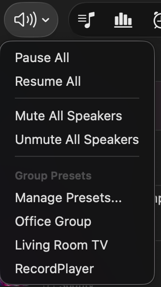
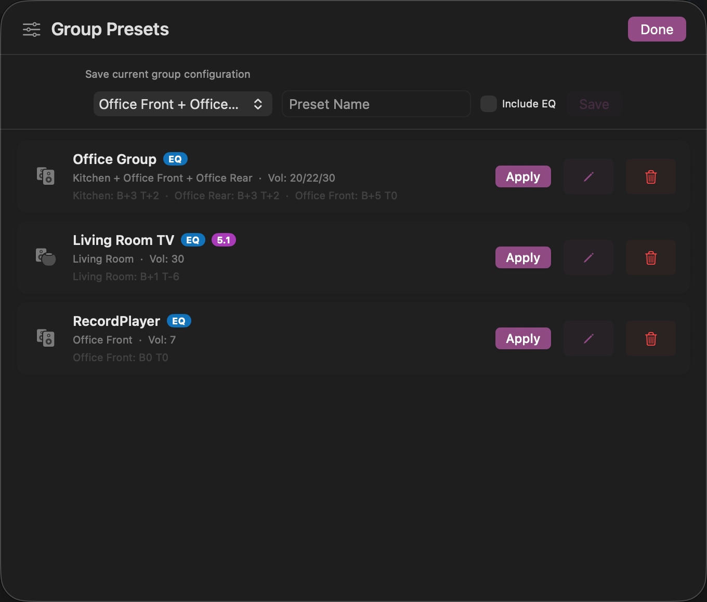
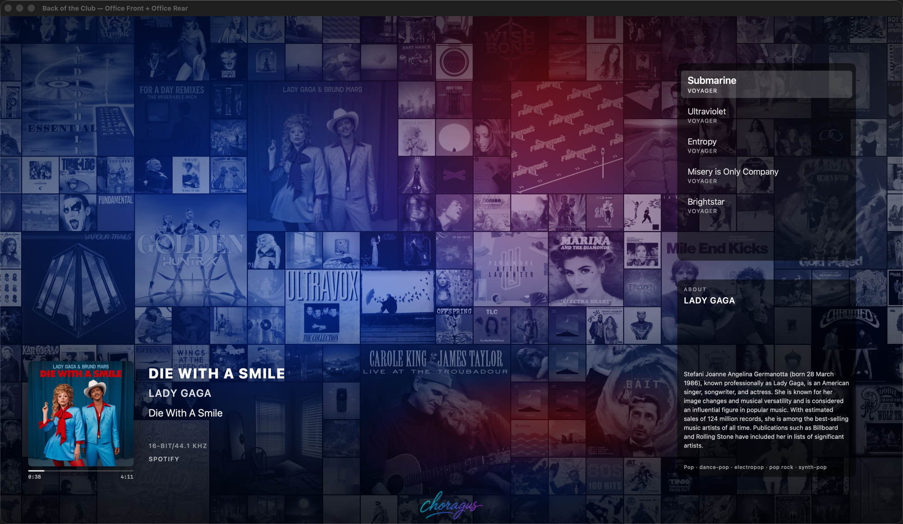
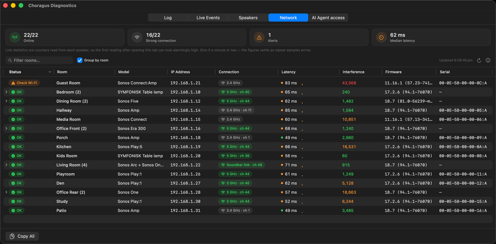

# Choragus

**Native macOS controller for Sonos speakers.** Built entirely in Swift and SwiftUI. Ships as a universal binary with native support for both Apple Silicon and Intel Macs.

> **Looking for internals?** See [technical_readme.md](technical_readme.md) for architecture, protocols, and build instructions.

---

## The Why

Sonos shipped a macOS desktop controller for years, but it was an Intel-only (x86_64) binary that relied on Apple's Rosetta 2 translation layer. Apple is discontinuing Rosetta 2 support, which means the official Sonos desktop app will stop working on modern Macs — and Sonos provided no indications of a replacement at the time, plus there were many personal tweaks I wanted.

This project was built from scratch by a Sonos fan who wanted to keep controlling their speakers from their Mac and add the functionality I wanted but was missing. It is not affiliated with, endorsed by, or derived from Sonos, Inc. in any way. No proprietary Sonos code, assets, or intellectual property were used. The app communicates with speakers using the open UPnP protocols that any device on your local network can see and use. All control happens locally — nothing is sent to the cloud.

Tested against a live Sonos system with 22 speakers across 15 zones and both S1 and S2 generations, a large local music library (45,000+ tracks), and multiple streaming services (Apple Music, Spotify, TuneIn, Calm Radio, Sonos Radio, etc).

---

## Installing on macOS

1. From the [latest release](https://github.com/scottwaters/Choragus/releases/latest), download `Choragus.dmg` and double-click it.
2. Drag `Choragus.app` into the Applications folder shown in the mounted window.
3. Eject the disk image, then launch Choragus from `/Applications`.

The DMG is signed with a Developer ID and notarized by Apple, so it launches cleanly with no Gatekeeper warning. On first launch macOS will ask for permission to access devices on your local network — grant it, or speaker discovery will not work.

## Setting Up Music Services

Once the app is installed, getting your streaming services (Spotify, Plex, TuneIn, Apple Music, etc.) to show up takes either one click or three steps depending on the service. For step-by-step instructions written for non-technical users, see **[Setupguide.md](Setupguide.md)**.

Short version:

- **TuneIn / Calm Radio / Sonos Radio / Apple Music search** — these services need to exist in your Sonos household first (radio services are usually pre-installed; Apple Music has to be added in the Sonos app). Then in Choragus press `⌘,`, scroll to **Music**, tick the checkbox. If a service isn't set up in Sonos, the toggle is disabled with an inline hint.
- **Spotify / Plex / Apple Music playback** — first add the service in the official Sonos app, then *(Spotify and Apple Music only)* play one song from it and save it as a Sonos Favorite, then come back to Choragus, press `⌘,`, **Music → Connected Services → Connect**, and sign in via the browser.

Why the favourited-song step? Sonos generates an internal account identifier the first time you save content from a service. Without it, no third-party app can authenticate playback through that service. It is a Sonos design constraint, not a Choragus limitation. The full explanation is in [Setupguide.md](Setupguide.md).

---

## What's new in v5.0

AI playlist building, an assistant that can drive Choragus, media servers, alarms, and a queue that repairs itself.

AI is optional and comes in four levels, from copying a prompt into whatever chat AI you already use, through to asking for music from your phone. [docs/AI.md](docs/AI.md) is the guide.

<picture>
  <source media="(prefers-color-scheme: dark)" srcset="docs/diagrams/ai-levels-dark.png">
  
</picture>

- **Build a playlist from a sentence.** Describe what you want, Choragus asks Claude, OpenAI or any OpenAI-compatible service, matches the reply on Apple Music, a signed-in service, your library or a media server, and saves or plays the result. No AI key? Copy the prompt into any chat AI and paste the list back.
- **Let an assistant control your speakers.** Settings → AI → AI Agent access turns Choragus into a local MCP server: rooms, playback, volume, grouping, queue, playlists, alarms, history and playlist building, with per-token access levels, a volume limit for agents, quiet hours and an activity log. Setup for Claude, Codex, Cursor and VS Code is in [docs/MCP.md](docs/MCP.md).
- **Play from your media server.** Plex, Synology, MinimServer and other DLNA/UPnP servers appear in Browse, found automatically or added by address. Plex plays show on the Plex dashboard and count toward play history.
- **Alarms, in the app.** The alarm icon lists every Sonos alarm; add, edit and delete inline, with the chime or any favourite as the program.
- **A queue that looks after itself.** Expired links and unreachable servers are found and repaired or flagged for removal; multi-select to move, copy or remove tracks; running time in the header, time left in the footer.
- **Playlist Manager grows up.** Playlists open by folder in every menu, deleted playlists wait in Deleted Items for 30 days, tracks play straight from the window, and local tracks now carry their length.
- **Amazon Music works**, and Pandora leaves the blocked list. Amazon Music Prime plays albums, playlists and stations; single tracks need Amazon Music Unlimited.
- **Smaller things.** Sidebar sections collapse and reorder, every list has a sort menu, a Select Input action for Shortcuts, Help regrouped in all 13 languages, and fixes for durations over an hour, media keys on a locked Mac, scroll-wheel direction and event subscriptions that went quiet.

Full change list in [CHANGELOG.md](CHANGELOG.md).

---

## Everything else Choragus does

The long-form reference, area by area, is in **[docs/FEATURES.md](docs/FEATURES.md)**. In short:

- **Three panels** — Browse, Now Playing and Queue — with full transport, shuffle, repeat, crossfade, sleep timer, group and per-speaker volume, EQ and home-theatre controls, stream-format badges, lyrics that scroll with the track, artist biographies and play history per track.

- **Your music, wherever it is** — the Sonos library on your NAS, Sonos favorites and playlists, media servers, Apple Music, Spotify, TIDAL, Amazon Music, Audible, Plex, TuneIn, Calm Radio, SomaFM, Sonos Radio and Suno, with search across the lot and a status dot per service in Settings.

- **Playlist Manager** — saved queues on this Mac in folders, Sonos playlists, automatic history snapshots and smart queues, with M3U/CSV export.
- **Listening Stats** — dashboard and history with filters, starring, export, and Last.fm scrobbling from your own history with per-room and per-service filters.
- **Rooms** — drag to group, presets that recall grouping, volumes and EQ, a menu-bar mini player, and Apple Shortcuts with Siri phrases.

- **Two Sonos systems at once** — S1 and S2 households side by side, each with its own library shares.
- **Visualisations** — Back of the Club, a wall of album art lit by the current cover, and a karaoke window readable from across the room.

### Karaoke and Back of the Club

**Karaoke** (`⌘K`) is a pop-out window built to be read from across the room: the current line large and bright, the lines around it fading away, the album art and track in the corner. Timed lyrics scroll with the track and can be nudged a few seconds either way; plain lyrics show as text.

**Back of the Club** (`⌘J`) fills a screen with a wall of album art from your own history, tinted by the cover playing now, with what is coming next and the artist's story down one side. Leave it on a TV or a spare display and it looks after itself.

### Diagnostics

The Diagnostics window (toolbar activity icon) has a tab for each thing that can go wrong. **Network** reads every speaker's link: band and channel, latency, interference and firmware, with a Check Wi-Fi flag on the weak one. **Log** and **Live Events** show what the app and the speakers are saying to each other, **Speakers** each player's model, role, address, firmware and event subscription, and **AI Agent access** every request an assistant made. Copy All puts the lot on the clipboard for a bug report.

## Earlier releases

Notes for v4.14 and earlier are in [CHANGELOG.md](CHANGELOG.md), which carries the full dated history; the [feature reference](docs/FEATURES.md) describes what those releases added as it stands today.

> **Upgrading from SonosController?** v4.0 renamed the project and changed the bundle identifier, so existing SonosController installs don't auto-upgrade — download Choragus once from the releases page; from then on updates arrive in the app.

---

## Privacy & Local-Only Operation

- **No accounts, no cloud.** The app talks directly to your speakers on your LAN.
- **No telemetry.** No analytics, no crash reporting, no usage tracking.
- **Tokens stay in Keychain.** When you connect a service like Spotify, the auth tokens live in macOS Keychain, protected so they can't be copied to another device.
- **App sandbox.** The app runs with minimal entitlements — network only. It can't read your files, contacts, or other apps.
- **All history stays on your Mac.** Listening history is a local SQLite file. You can clear it at any time from Settings.

---

## Requirements

- macOS 14.0 (Sonoma) or later
- Apple Silicon Mac (M1+) or Intel Mac
- Sonos speakers on the same local network

Building from source: see [technical_readme.md](technical_readme.md#building-from-source).

---

## Forking & home builds

A few features in the upstream binary depend on credentials and infrastructure that aren't included in the source. Self-built copies still work; those features stay inert or fall back. See **[docs/FORKS.md](docs/FORKS.md)** for what's affected and how to substitute your own.

---

## Known Limitations

- **Apple Music** — search works via the iTunes API; playback requires Apple Music connected in the Sonos app plus one favorited song.
- **Sonos Radio** — search works anonymously; browsing categories requires DeviceLink, which Choragus does not implement.
- **YouTube Music** — blocked (requires a native OAuth flow that isn't available to third-party apps).
- **Amazon Music** — on an S1 system albums enqueue track by track; on any system an Amazon Music Prime account plays stations, albums and playlists but not single tracks (Amazon Music Unlimited does). Podcasts are browsable but untested for playback.
- **Adding to Favorites** — requires the official Sonos app (the UPnP `CreateObject` action is not supported by Sonos firmware).
- **Adding music library folders** — also requires the Sonos app. Choragus lists the folders each system indexes and can trigger a reindex, but `CreateObject` on the share container returns success and stores nothing (verified on S1 and S2).
- **Plex – Remote behind CGNAT** — Plex's Sonos service needs the server reachable at a direct public address; a relay-only server is reported by Plex as unavailable. Plex – Local works on the network regardless.
- **Media servers across VLANs** — the speaker, not the Mac, fetches the audio, so a server on another VLAN needs a firewall rule from the speakers' VLAN to the server's port. Settings → Media Servers names the speakers that cannot reach it.

## License

PolyForm Noncommercial 1.0.0 — see [LICENSE](LICENSE). Copyright © 2024-2026 Choragus contributors. Free for personal, hobbyist, educational, charitable, and other noncommercial use; commercial use requires a separate agreement. These terms apply retroactively to every version of the software ever released under any name — including all releases previously distributed as **SonosController** (the project's former name). Any prior MIT-licensed SonosController or Choragus releases are superseded.

## Disclaimer

This project is not affiliated with, endorsed by, or connected to Sonos, Inc. or any of the music service providers referenced in this software. All trademarks are the property of their respective owners: "Sonos" and "Sonos Radio" are trademarks of Sonos, Inc.; "Spotify" is a trademark of Spotify AB; "Apple Music" and "iTunes" are trademarks of Apple Inc.; "Amazon Music" is a trademark of Amazon.com, Inc.; "YouTube Music" is a trademark of Google LLC; "TuneIn" is a trademark of TuneIn, Inc.; "TIDAL" is a trademark of Aspiro AB; "Deezer" is a trademark of Deezer SA; "SoundCloud" is a trademark of SoundCloud Limited; "iHeartRadio" is a trademark of iHeartMedia, Inc.; "Plex" is a trademark of Plex, Inc.; "Calm Radio" is a trademark of Calm Radio Ltd.

This software is an independent, fan-built controller that communicates with Sonos hardware using standard UPnP protocols. No proprietary code, assets, or intellectual property from any of these companies was used. Use at your own risk.

