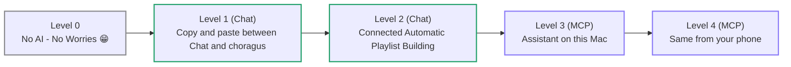
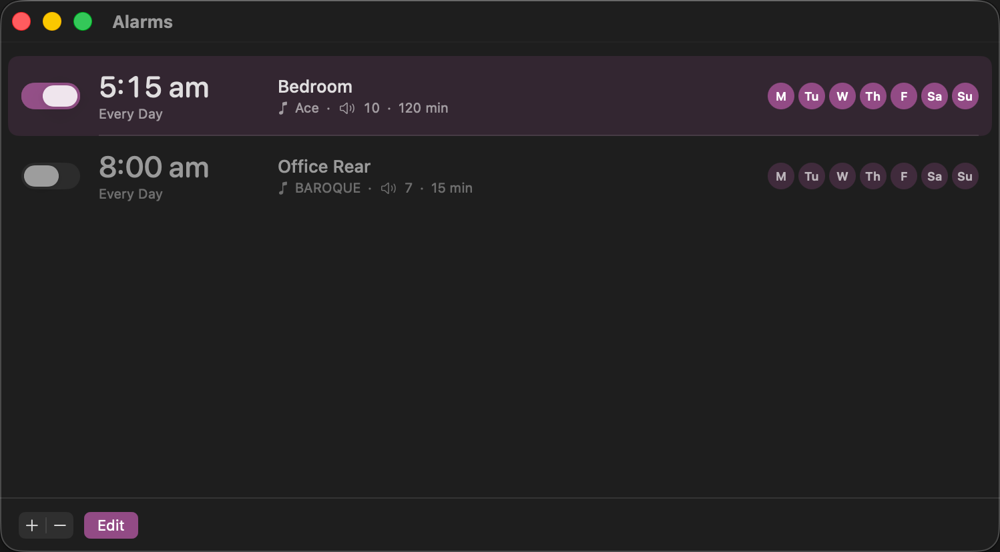
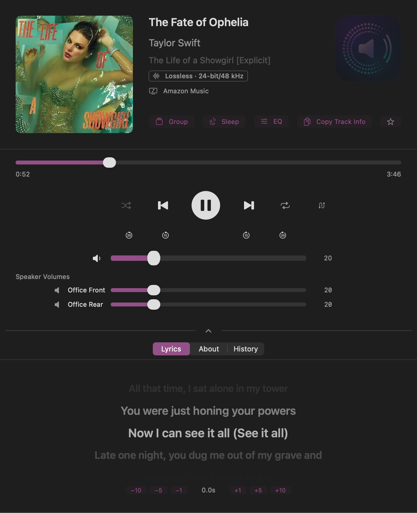
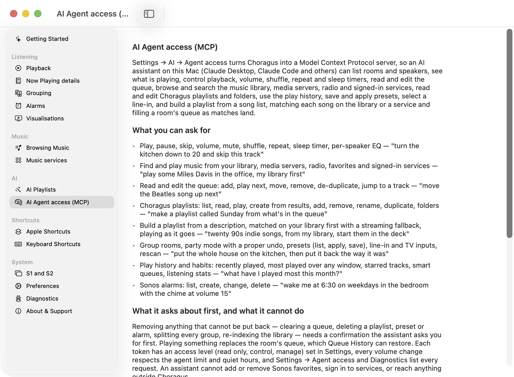

# Choragus

**Native macOS controller for Sonos speakers.** Built entirely in Swift and SwiftUI. Ships as a universal binary with native support for both Apple Silicon and Intel Macs.

> **Looking for internals?** See [technical_readme.md](technical_readme.md) for architecture, protocols, and build instructions.

---

## The Why

Sonos shipped a macOS desktop controller for years, but it was an Intel-only (x86_64) binary that relied on Apple's Rosetta 2 translation layer. Apple is discontinuing Rosetta 2 support, which means the official Sonos desktop app will stop working on modern Macs — and Sonos provided no indications of a replacement at the time, plus there were many personal tweaks I wanted.

This project was built from scratch by a Sonos fan who wanted to keep controlling their speakers from their Mac and add the functionality I wanted but was missing. It is not affiliated with, endorsed by, or derived from Sonos, Inc. in any way. No proprietary Sonos code, assets, or intellectual property were used. The app communicates with speakers using the open UPnP protocols that any device on your local network can see and use. All control happens locally — nothing is sent to the cloud.

Tested against a live Sonos system with 22 speakers across 15 zones and both S1 and S2 generations, a large local music library (45,000+ tracks), and multiple streaming services (Apple Music, Spotify, TuneIn, Calm Radio, Sonos Radio, etc).

---

## Installing on macOS

1. From the [latest release](https://github.com/scottwaters/Choragus/releases/latest), download `Choragus.dmg` and double-click it.
2. Drag `Choragus.app` into the Applications folder shown in the mounted window.
3. Eject the disk image, then launch Choragus from `/Applications`.

The DMG is signed with a Developer ID and notarized by Apple, so it launches cleanly with no Gatekeeper warning. On first launch macOS will ask for permission to access devices on your local network — grant it, or speaker discovery will not work.

## Setting Up Music Services

Once the app is installed, getting your streaming services (Spotify, Plex, TuneIn, Apple Music, etc.) to show up takes either one click or three steps depending on the service. For step-by-step instructions written for non-technical users, see **[Setupguide.md](Setupguide.md)**.

Short version:

- **TuneIn / Calm Radio / Sonos Radio / Apple Music search** — these services need to exist in your Sonos household first (radio services are usually pre-installed; Apple Music has to be added in the Sonos app). Then in Choragus press `⌘,`, scroll to **Music**, tick the checkbox. If a service isn't set up in Sonos, the toggle is disabled with an inline hint.
- **Spotify / Plex / Apple Music playback** — first add the service in the official Sonos app, then *(Spotify and Apple Music only)* play one song from it and save it as a Sonos Favorite, then come back to Choragus, press `⌘,`, **Music → Connected Services → Connect**, and sign in via the browser.

Why the favourited-song step? Sonos generates an internal account identifier the first time you save content from a service. Without it, no third-party app can authenticate playback through that service. It is a Sonos design constraint, not a Choragus limitation. The full explanation is in [Setupguide.md](Setupguide.md).

---

## What's new in v5.0

Many additions - an AI playlist builder and a local MCP server so your AI assistant can drive choragus and the speakers — plus DLNA media servers, alarms, self repairing queues, restructure of main app core code, more music service support, and a long, long list of smaller things.

AI is entirely optional and arrives in four levels, from copying a prompt into whatever chat AI you already use, through to asking for music from your phone. **[docs/AI.md](docs/AI.md) is the guide**: what each level does, what it needs, how to set it up, and what leaves your Mac.

### Build playlists with AI

Describe the playlist you want — "90s trip-hop for a rainy evening, nothing over 5 minutes", "twenty songs my kids will sing along to", "the best of 1971", "songs by artists the Beatles cited as their biggest influences in earliest to latest release date"  — and the songs stream into a table as the model writes them. Then **Match to** a source: your **local library first** if you like, Apple Music, Spotify or any signed-in service, or a media server such as Plex. Each song becomes a real, playable track; the ones that could not be found are listed so you can try them elsewhere. Save the result as a Choragus playlist (into any folder), add it to the queue, play it next, or play it now.

- Works with **Claude, OpenAI, or any OpenAI-compatible endpoint** — DeepSeek, Ollama, LM Studio and the like — set up under Settings → AI with a name, a key kept in the keychain, and a Test button; the model list comes from the provider itself.
- No AI service at all? **Copy prompt** gives you a ready-made request for any chat AI, and **Paste list** reads the reply back. The same button takes any list you type yourself, one song per line.
- The reply is treated as untrusted text end to end, keys are only ever sent to their own provider, and the matching paces itself so Apple Music does not throttle you.

Setup for both ways of doing it — with a key, or with nothing but the clipboard — is in [docs/AI.md](docs/AI.md#level-1--copy-and-paste-playlists).

### Talk to it: AI Agent access (MCP)

An AI assistant on your Mac can drive Choragus through the Model Context Protocol. The server runs inside Choragus on `127.0.0.1`; nothing is routed through a cloud on Choragus's side, and the assistant reaches your **local library and media servers** as well as the **cloud services** signed in to Sonos. Ask it to play something in a room, group the house, build a playlist from a description, tidy the queue, set an alarm, or tell you what you listened to most this month — it does the work through 116 tools over the same code the app uses — everything the app itself can do short of changing its settings.

**Things you can say**

- "What's playing in the kitchen?"
- "Turn the office down to 20 and skip this track."
- "Play Kind of Blue in the living room — from my library if you have it, otherwise Apple Music."
- "Put the whole house on the kitchen, then put it back the way it was."
- "Make me a 90s indie playlist from my own music and start it on the deck." The queue fills as songs match; songs it could not find are listed so you can say "try those on Spotify".
- "Save what's in the queue as a playlist called Sunday."
- "What have I listened to most this month?"
- "Wake me at 6:30 on weekdays in the bedroom with the chime at volume 15."

It asks before clearing a queue, deleting a playlist, preset or alarm, splitting every group or re-indexing the library, unless you switch **Skip confirmations** on for that token.

**What it can reach**

- Rooms, playback, volume (room, group-proportional, per speaker), mute, shuffle, repeat, crossfade, sleep timer, per-speaker EQ.
- Your Sonos library (search by track, artist, album, genre, composer, and browse the tree), DLNA media servers, TuneIn radio, Sonos favorites, Apple Music and any signed-in service.
- The queue: read, add, play next, move, remove, de-duplicate, jump, save as a playlist; edits can be pinned to the queue's revision so nothing changed underneath them.
- Choragus playlists and folders: list, read, play, create, add, remove, rename, duplicate, move, delete.
- The playlist builder as a background job: match a song list on your library first, fall back to a service for the misses, append each match to a room's queue as it lands, save the result; cancel or undo.
- Play history: recently played, most played over any window, starred tracks, smart queues, listening stats.
- Grouping with snapshot and restore (party mode you can undo), presets (list, read, apply, save, delete), line-in and TV inputs, Sonos alarms.
- The rest of the app: full EQ including sub and surrounds, Sonos-side playlists, folders and Deleted Items, queue undo history, M3U/CSV export, lyrics, artist and album information, Suno links, Last.fm scrobbling, speaker network status, the diagnostics log, and opening Back of the Club or Karaoke on a room.

**Setup**

1. Settings → AI → AI Agent access: switch **Enable MCP server** on. Add a token for each assistant: type a name such as "Claude Desktop", pick its access level (read only, control, or manage), click Add token. The token is copied to the clipboard; paste it into the client now, because Settings shows only its first characters afterwards.
2. Claude Desktop: open its MCP settings (Settings → Developer → Edit Config) and add the block from [MCP.md](docs/MCP.md) with the endpoint `http://127.0.0.1:52080/mcp` and your token, then restart Claude Desktop. Claude Code: one command, `claude mcp add --transport http choragus http://127.0.0.1:52080/mcp --header "Authorization: Bearer <token>"`. Cursor, VS Code and the OpenAI tools take the same endpoint; [MCP.md](docs/MCP.md) has each configuration.
3. Keep Choragus running: **Open Choragus at login** and **Prevent the Mac from sleeping** are in the same section. The main window can stay closed when Menu Bar Controls are on.
4. Try it: ask the assistant "what rooms do I have?" — it should list your Sonos rooms.

**Safety**

- Loopback only unless you allow other devices; tokens live in the keychain and are compared in constant time; web pages and unknown host names are refused; five wrong tokens lock an address out for five minutes; each token is rate-limited.
- A volume limit for agents (default 80) and optional quiet hours with a lower limit apply to every volume change, alarm and preset; each token can be set to skip confirmations if you trust that assistant to act alone.
- Anything that removes what cannot be put back — clearing a queue, deletes, splitting all groups, re-indexing — is marked destructive and asks the assistant to confirm.
- Settings → AI Agent access shows every request by token; Diagnostics → AI Agent access and the bug-report bundle carry the same log.

**From your phone**

The phone never talks to your Mac, and nothing is published to the internet. Instead you drive a session that is *running on the Mac*, and that session makes the loopback call to Choragus. With Claude that is Remote Control — `claude --remote-control "Choragus"` on the Mac, then **Code** in the Claude app on your phone. With ChatGPT it is a Codex task backed by your Mac. Either way the full 116 tools answer exactly as they do at your desk, with no tunnel, no certificate and no public hostname. [docs/AI.md](docs/AI.md#level-4--the-same-from-your-phone) walks through it.

[docs/AI.md](docs/AI.md#level-3--an-assistant-drives-choragus-mcp) is the step-by-step guide; [MCP.md](docs/MCP.md) lists every tool, the client configurations, and the protocol details.

### Also new

- **Play from your media server.** Plex, Synology, MinimServer and other DLNA/UPnP servers appear in Browse; the server supplies the library and the artwork, the speaker plays the track. Settings → Media Servers lists what was found, lets you add one by address, and names any speaker that cannot reach it.

- **Alarms, in the app.** The alarm icon in the toolbar lists every Sonos alarm with a week strip and a switch; add or edit one with time, room, music from your Sonos favorites, days, volume and duration.

- **A queue that looks after itself.** Expired links and unreachable servers are found before they play and repaired where possible; select several tracks to move, copy or remove them together; the header shows the running time and the footer the time left.

- **Track lengths for local music.** Sonos reports no length for library tracks; Choragus now remembers the length from the last time each one played, so the queue total, Queue Library and assistants see it.
- **Playlist Manager grows up.** Playlists open by folder in every menu, deleted playlists wait in Deleted Items for 30 days, the window opens instantly, tracks can be played from it directly, and Build Playlist offers a fresh sample prompt each time.

- **Plex plays count.** Tracks played from your Plex server show as an active stream and count toward play history and play counts.
- **Amazon Music works.** Sign in under Settings → Music and browse, search and play (patch contributed in #88). Amazon Music Prime plays albums, playlists and stations; single tracks need Amazon Music Unlimited.

- **Browse is tidier.** Sidebar sections are cards you can collapse and drag into your own order; every list has a sort menu.
- **Shortcuts can select an input.** A new Select Input action plays a speaker's line-in or TV input in any room; [docs/SHORTCUTS.md](docs/SHORTCUTS.md) covers every action and how to run one on a schedule.
- **Diagnostics for agents.** Diagnostics → AI Agent access lists every request an assistant made, with its full arguments and result a click away, and the bug-report bundle carries the same.
- **Help rewritten and grouped** into Listening, Music, AI, Shortcuts and System, selectable and copyable, in all 13 languages.

 **Fixes across the board:** durations over an hour, media keys on a locked Mac, scroll-wheel direction, Suno playlists, service names in Settings, and event subscriptions that used to go quiet after a while.

Full change list in [CHANGELOG.md](CHANGELOG.md).

---

## Everything else Choragus does

The long-form reference, area by area, is in **[docs/FEATURES.md](docs/FEATURES.md)**. In short:

- **Three panels** — Browse, Now Playing and Queue — with full transport, shuffle, repeat, crossfade, sleep timer, group and per-speaker volume, EQ and home-theatre controls, stream-format badges, lyrics that scroll with the track, artist biographies and play history per track.

- **Your music, wherever it is** — the Sonos library on your NAS, Sonos favorites and playlists, media servers, Apple Music, Spotify, TIDAL, Amazon Music, Audible, Plex, TuneIn, Calm Radio, SomaFM, Sonos Radio and Suno, with search across the lot and a status dot per service in Settings.

- **Playlist Manager** — saved queues on this Mac in folders, Sonos playlists, automatic history snapshots and smart queues, with M3U/CSV export.
- **Listening Stats** — dashboard and history with filters, starring, export, and Last.fm scrobbling from your own history with per-room and per-service filters.
- **Rooms** — drag to group, presets that recall grouping, volumes and EQ, a menu-bar mini player, and Apple Shortcuts with Siri phrases.

- **Two Sonos systems at once** — S1 and S2 households side by side, each with its own library shares.
- **Visualisations** — Back of the Club, a wall of album art lit by the current cover, and a karaoke window readable from across the room.

### Karaoke and Back of the Club

**Karaoke** (`⌘K`) is a pop-out window built to be read from across the room: the current line large and bright, the lines around it fading away, the album art and track in the corner. Timed lyrics scroll with the track and can be nudged a few seconds either way; plain lyrics show as text.

**Back of the Club** (`⌘J`) fills a screen with a wall of album art from your own history, tinted by the cover playing now, with what is coming next and the artist's story down one side. Leave it on a TV or a spare display and it looks after itself.

### Diagnostics

The Diagnostics window (toolbar activity icon) has a tab for each thing that can go wrong. **Network** reads every speaker's link: band and channel, latency, interference and firmware, with a Check Wi-Fi flag on the weak one. **Log** and **Live Events** show what the app and the speakers are saying to each other, **Speakers** each player's model, role, address, firmware and event subscription, and **AI Agent access** every request an assistant made. Copy All puts the lot on the clipboard for a bug report.

## Earlier releases

Notes for v4.14 and earlier are in [CHANGELOG.md](CHANGELOG.md), which carries the full dated history; the [feature reference](docs/FEATURES.md) describes what those releases added as it stands today.

> **Upgrading from SonosController?** v4.0 renamed the project and changed the bundle identifier, so existing SonosController installs don't auto-upgrade — download Choragus once from the releases page; from then on updates arrive in the app.

---

## Privacy & Local-Only Operation

- **No accounts, no cloud.** The app talks directly to your speakers on your LAN.
- **No telemetry.** No analytics, no crash reporting, no usage tracking.
- **Tokens stay in Keychain.** When you connect a service like Spotify, the auth tokens live in macOS Keychain, protected so they can't be copied to another device.
- **App sandbox.** The app runs with minimal entitlements — network only. It can't read your files, contacts, or other apps.
- **All history stays on your Mac.** Listening history is a local SQLite file. You can clear it at any time from Settings.

---

## Requirements

- macOS 14.0 (Sonoma) or later
- Apple Silicon Mac (M1+) or Intel Mac
- Sonos speakers on the same local network

Building from source: see [technical_readme.md](technical_readme.md#building-from-source).

---

## Forking & home builds

A few features in the upstream binary depend on credentials and infrastructure that aren't included in the source. Self-built copies still work; those features stay inert or fall back. See **[docs/FORKS.md](docs/FORKS.md)** for what's affected and how to substitute your own.

---

## Known Limitations

- **Apple Music** — search works via the iTunes API; playback requires Apple Music connected in the Sonos app plus one favorited song.
- **Sonos Radio** — search works anonymously; browsing categories requires DeviceLink auth (not yet supported).
- **YouTube Music** — blocked (requires a native OAuth flow that isn't available to third-party apps).
- **Amazon Music** — on an S1 system albums enqueue track by track; on any system an Amazon Music Prime account plays stations, albums and playlists but not single tracks (Amazon Music Unlimited does). Podcasts are browsable but untested for playback.
- **Adding to Favorites** — requires the official Sonos app (the UPnP `CreateObject` action is not supported by Sonos firmware).
- **Adding music library folders** — also requires the Sonos app. Choragus lists the folders each system indexes and can trigger a reindex, but `CreateObject` on the share container returns success and stores nothing (verified on S1 and S2).
- **Plex – Remote behind CGNAT** — Plex's Sonos service needs the server reachable at a direct public address; a relay-only server is reported by Plex as unavailable. Plex – Local works on the network regardless.
- **Media servers across VLANs** — the speaker, not the Mac, fetches the audio, so a server on another VLAN needs a firewall rule from the speakers' VLAN to the server's port. Settings → Media Servers names the speakers that cannot reach it.

## License

PolyForm Noncommercial 1.0.0 — see [LICENSE](LICENSE). Copyright © 2024-2026 Choragus contributors. Free for personal, hobbyist, educational, charitable, and other noncommercial use; commercial use requires a separate agreement. These terms apply retroactively to every version of the software ever released under any name — including all releases previously distributed as **SonosController** (the project's former name). Any prior MIT-licensed SonosController or Choragus releases are superseded.

## Disclaimer

This project is not affiliated with, endorsed by, or connected to Sonos, Inc. or any of the music service providers referenced in this software. All trademarks are the property of their respective owners: "Sonos" and "Sonos Radio" are trademarks of Sonos, Inc.; "Spotify" is a trademark of Spotify AB; "Apple Music" and "iTunes" are trademarks of Apple Inc.; "Amazon Music" is a trademark of Amazon.com, Inc.; "YouTube Music" is a trademark of Google LLC; "TuneIn" is a trademark of TuneIn, Inc.; "TIDAL" is a trademark of Aspiro AB; "Deezer" is a trademark of Deezer SA; "SoundCloud" is a trademark of SoundCloud Limited; "iHeartRadio" is a trademark of iHeartMedia, Inc.; "Plex" is a trademark of Plex, Inc.; "Calm Radio" is a trademark of Calm Radio Ltd.

This software is an independent, fan-built controller that communicates with Sonos hardware using standard UPnP protocols. No proprietary code, assets, or intellectual property from any of these companies was used. Use at your own risk.

