# Choragus

**Native macOS controller for Sonos speakers.** Built entirely in Swift and SwiftUI. Ships as a universal binary with native support for both Apple Silicon and Intel Macs.

> Choragus was previously named *SonosController*. Same project, same code; renamed in respect of the Sonos trademark.

> **Looking for internals?** See [technical_readme.md](technical_readme.md) for architecture, protocols, and build instructions.

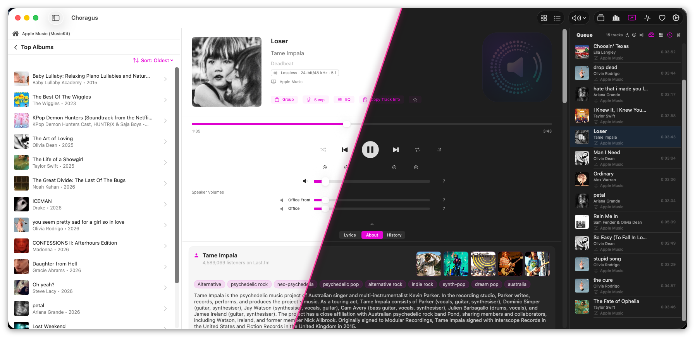

---

## Why This Exists

Sonos shipped a macOS desktop controller for years, but it was an Intel-only (x86_64) binary that relied on Apple's Rosetta 2 translation layer. Apple is discontinuing Rosetta, which means the official Sonos desktop app will stop working on modern Macs — and Sonos appears to have no plans to release a native replacement.

This project was built from scratch by a Sonos fan who wanted to keep controlling their speakers from their Mac. It is not affiliated with, endorsed by, or derived from Sonos, Inc. in any way. No proprietary Sonos code, assets, or intellectual property were used. The app communicates with speakers using the open UPnP protocols that any device on your local network can see and use. All control happens locally — nothing is sent to the cloud.

Tested against a live Sonos system with 16 speakers across 10 zones, a large local music library (45,000+ tracks), and multiple streaming services (Apple Music, Spotify, TuneIn, Calm Radio, Sonos Radio).

---

## Installing on macOS

1. From the [latest release](https://github.com/scottwaters/Choragus/releases/latest), download `Choragus.dmg` and double-click it.
2. Drag `Choragus.app` into the Applications folder shown in the mounted window.
3. Eject the disk image, then launch Choragus from `/Applications`.

The DMG is signed with a Developer ID and notarized by Apple, so it launches cleanly with no Gatekeeper warning. On first launch macOS will ask for permission to access devices on your local network — grant it, or speaker discovery will not work.

## Setting Up Music Services

Once the app is installed, getting your streaming services (Spotify, Plex, TuneIn, Apple Music, etc.) to show up takes either one click or three steps depending on the service. For step-by-step instructions written for non-technical users, see **[Setupguide.md](Setupguide.md)**.

Short version:

- **TuneIn / Calm Radio / Sonos Radio / Apple Music search** — these services need to exist in your Sonos household first (radio services are usually pre-installed; Apple Music has to be added in the Sonos app). Then in Choragus press `⌘,`, scroll to **Music**, tick the checkbox. If a service isn't set up in Sonos, the toggle is disabled with an inline hint.
- **Spotify / Plex / Apple Music playback** — first add the service in the official Sonos app, then *(Spotify and Apple Music only)* play one song from it and save it as a Sonos Favorite, then come back to Choragus, press `⌘,`, **Music → Connected Services → Connect**, and sign in via the browser.

Why the favourited-song step? Sonos generates an internal account identifier the first time you save content from a service. Without it, no third-party app can authenticate playback through that service. It is a Sonos design constraint, not a Choragus limitation. The full explanation is in [Setupguide.md](Setupguide.md).

---

## What's New in v4.14

Home-theatre controls, sidebar grouping, and a queue that keeps up.

- **Night Mode and Dialog Enhancement in Now Playing.** No trip to the EQ window for the two settings you change nightly — and the Surrounds tab now appears on every system that actually has surrounds.
- **Group from the sidebar.** Double-click a room to edit its group, or drag one room onto another to group them.
- **The queue keeps up.** The playing track stays in view as tracks change, with the highlight and level bars arriving within about a second instead of lagging or dropping out.
- **Silent queues explain themselves.** When a saved queue's track links have expired, the speaker skips through them without a sound and without an error; Choragus now tells you what happened and what to do about it.
- **Media keys can be turned off.** Some Bluetooth and USB headsets send a play command when a call ends, which could start music unexpectedly. Settings → Keyboard Controls hands the keys back to other apps.
- **Volume that moves together.** Hold the group slider at zero for a second and every speaker rises in sync.
- **Rename favourites**, and see which folders each Sonos system indexes as local music.
- **Rooms that went missing come back.** A group whose coordinator no longer matched its own members left the system visible but uncontrollable until a relaunch; it now repairs itself.
- **Speakers on another VLAN.** The speaker search now crosses routers instead of stopping at the first one, with a hop limit you can raise in Settings → System.
- **Help covers the whole app**, in all 13 languages.

Full change list in [CHANGELOG.md](CHANGELOG.md).

---

## Earlier releases

Notes for v4.13 and earlier are in [CHANGELOG.md](CHANGELOG.md), which carries the full dated history.

> **Upgrading from SonosController?** v4.0 renamed the project and changed the bundle identifier, so existing SonosController installs don't auto-upgrade — download Choragus fresh and re-authenticate your music services on first launch. Play history, presets, stats, and preferences carry over automatically. Full note in [CHANGELOG.md](CHANGELOG.md#v40--2026-04-27--choragus).

---

## Features

### The Toolbar

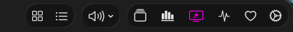

Left to right, above the panels:

| Icon | What it does |
|---|---|
| Grid | Show or hide the Browse panel |
| List | Show or hide the Queue panel |
| Speaker | Pause all, resume all, mute all, and the preset menu |
| Stack | Queue Library (`⌘L`) |
| Bar chart | Listening Stats (`⇧⌘S`) |
| Sparkles over a screen | Visualisations — Back of the Club and the karaoke popout |
| Activity trace | Diagnostics |
| Heart | Ways to support the project — official builds only |
| Gear | Settings (`⌘,`) |

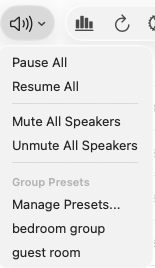

### Now Playing, Browse, and Queue

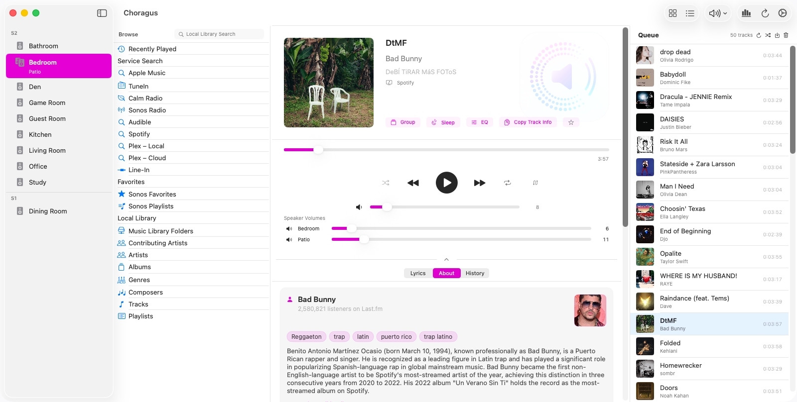

The main view shows three panels: **Browse** (left), **Now Playing** (centre), and **Queue** (right). All three are togglable from the toolbar. The Now Playing panel is guaranteed a minimum width of 640 px — the side panels shrink proportionally when the window is resized.

**Now Playing** shows album art with automatic artwork resolution from multiple sources (speaker metadata, iTunes Search, manual override). Right-click the artwork to search for alternative art, ignore incorrect art, or refresh. The service tag names the source: Spotify, Radio, Music Library, and so on.

**Star any track** — click the star icon next to Copy Track Info to star the currently playing track. Works for any source: queue tracks, radio streams, Spotify, Apple Music — any track where metadata is available. Starred tracks are saved locally and can be filtered in the listening history. Star and unstar from Now Playing or the menu-bar mini player.

**Copy Track Details** copies the current track's metadata to the clipboard in a clean format:

```
Artist: Lofi Girl
Album: Lofi Girl x Assassin's Creed Shadows - stealthy beats to relax to
Track: A Moment of Sweetness - Prithvi Remix
```

Useful for sharing, logging, or searching another platform.

**Playback controls** — play, pause, stop, skip, seek with a draggable slider and smooth position interpolation. Shuffle, repeat (off / all / one), crossfade, sleep timer. Pause-all / Resume-all from the toolbar menu.

**Stream details** sit above the service name: a **Dolby Atmos** badge when the speaker reports a spatial stream and the coordinator supports it, the **TV input format** for HDMI sources (Dolby Digital 5.1, Atmos TrueHD 7.1, DTS and so on), and otherwise the container with bit depth and sample rate — `FLAC · Lossless · 24-bit/96 kHz`. Nothing is shown when the speaker reports no detail, which is common on services that don't publish it. The Back of the Club wall shows the same line above the source name.

For a home-theatre zone, **Night Mode** and **Dialog Enhancement** appear directly below the group buttons. The full set of home-theatre settings stays in the EQ window.

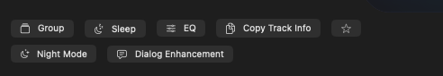

**Lyrics, About, and History** sit in tabs below the transport controls. Lyrics are fetched per track and scroll in time with playback when timed lyrics exist, or display as plain text when they don't. About pulls the artist biography, listener count, and tags from Last.fm. History lists previous plays of the current track.

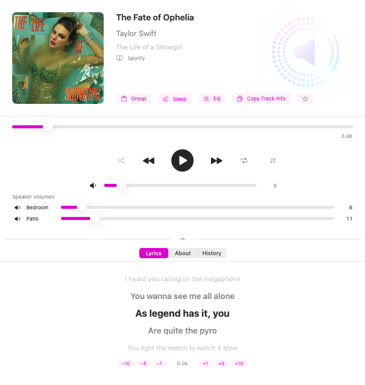

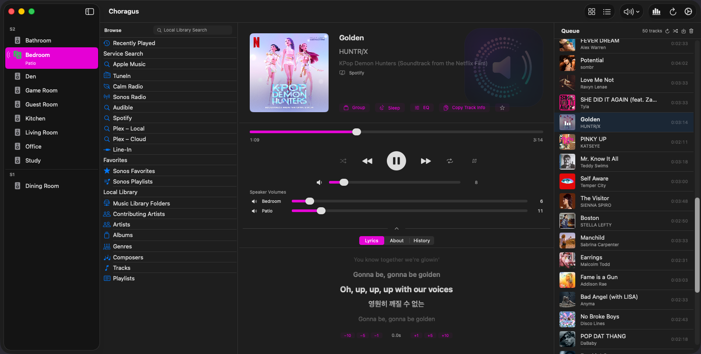

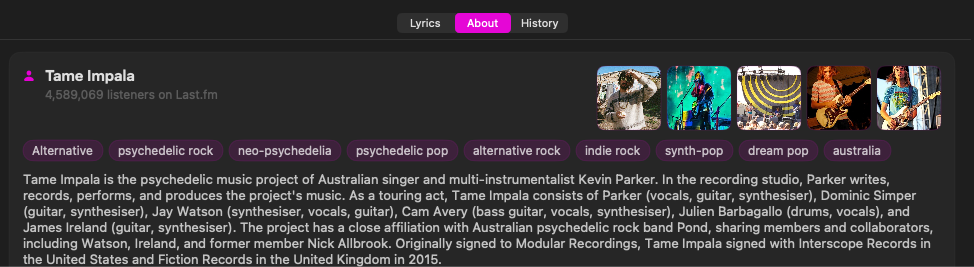

**Volume** — master slider covers the whole group (proportional or linear mode). Individual per-speaker sliders with drag protection. Mute toggle per speaker and master. Bass, treble, loudness, and Home Theater EQ (sub/surround levels, night mode, dialog enhancement) via the EQ panel.

**Scroll-wheel + middle-click** *(v3.6)* — hover over the Now Playing view and scroll the mouse wheel to adjust the master volume of the selected speaker. Middle-click anywhere on the view toggles mute. Discrete steps, debounced so rapid flicks don't spam the speaker with SOAP calls.

### Browse & Library

The Browse panel reaches your music library and connected services:

- **Service Search** — Apple Music, TuneIn, Calm Radio, Sonos Radio, Spotify (individually toggleable in Settings)
- **Sonos Favorites & Playlists** — everything you've set up in the Sonos app
- **Local Library** — NAS/network music library with artists, albums, tracks, genres, composers, folder browsing
- **Recently Played** — quick access to tracks from your listening history
- **Search** — local library search across artists, albums, and tracks
- Play now, play next, add to queue, replace queue from the context menu
- Drag tracks from Browse directly into the Queue

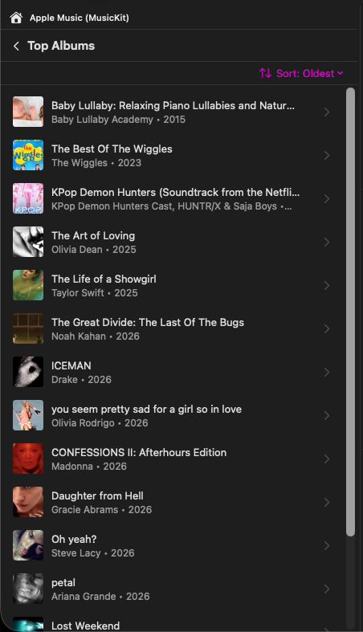

### Queue

The Queue panel shows the current play queue with album art, track info, and duration. Tap to jump to a track, drag to reorder, right-click to remove. Queue shuffle physically reorders the tracks. Save the current queue as a Sonos playlist, an Apple Music playlist when every track is an Apple Music one, or into Choragus's own Queue Library.

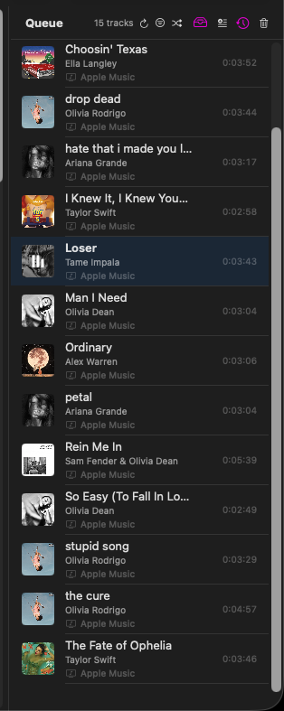

As tracks change the view follows the speaker: the previous track stays at the top so the playing track sits just below it, and the queue scrolls on toward the end when too few tracks remain to slide.

### Queue Library

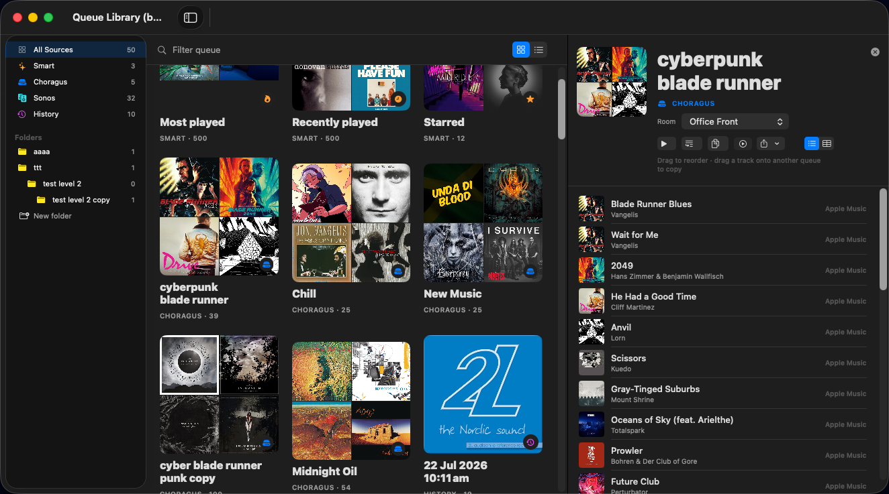

A separate window (`⌘L`) holding saved queues, split by source in the sidebar: **Choragus** queues stored on this Mac, **Sonos** playlists read from the system, **History** snapshots taken automatically, and **Smart** queues (Most Played over the last 30 days, Recently Played, Starred).

Queues can be filed into folders and subfolders, and the same queue can sit in more than one folder. Switch between an artwork grid and a list, filter by title, then select a queue to see its tracks, choose which room to play into, reorder by dragging, or drag a track onto another queue to copy it there. Export a queue as M3U or CSV, duplicate it, or clone it into a Choragus queue; the clone can be edited while the original Sonos playlist stays unchanged.

### Music Services

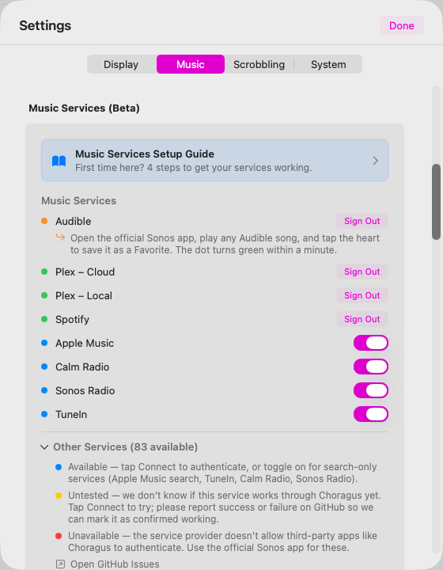

Services are managed in **Settings → Music**. Each can be individually enabled. **First-time setup is described in plain language in [Setupguide.md](Setupguide.md)** — start there if you're not sure how to get a service showing up.

#### Available — No Connection Required

| Service | Browse | Search | Playback | Notes |
|---------|:------:|:------:|:--------:|-------|
| **Local Music Library** | ✓ | ✓ | ✓ | NAS / network shares via UPnP |
| **Sonos Favorites** | ✓ | — | ✓ | Favorites set up in the Sonos app |
| **Sonos Playlists** | ✓ | — | ✓ | Playlists saved from queues |
| **TuneIn** | ✓ | ✓ | ✓ | Public RadioTime API, no login needed |
| **Calm Radio** | ✓ | — | ✓ | Public API, no login needed |
| **Apple Music** | — | ✓ | ✓ | Search via iTunes API. Playback requires Apple Music connected in the Sonos app and one favorited song — this lets the app discover your account credentials. Once set up, all search results are directly playable |
| **Sonos Radio** | — | ✓ | ✓ | Search via anonymous SMAPI. Category browsing requires DeviceLink auth (not yet supported) |

#### Available — Connection Required (Tested)

| Service | Browse | Search | Playback | Notes |
|---------|:------:|:------:|:--------:|-------|
| **Spotify** | ✓ | ✓ | ✓ | AppLink authentication. Connect in Settings, then add one favorited song via the Sonos app |
| **Plex** *(v3.7)* | ✓ | ✓ | ✓ | AppLink authentication via [app.plex.tv/auth](https://app.plex.tv/auth). Streams from your own Plex Media Server — no third-party CDN, no short-lived signatures |
| **Audible** *(v4.0)* | ✓ | ✓ | ✓ | AppLink authentication. Confirmed working for audiobook playback; chapter navigation behaves like a queue |

#### Available — Connection Required (Untested)

40+ additional services are available via SMAPI AppLink/DeviceLink and may work — connect via **Settings → Music → Other Services**. Results are not guaranteed.

| Service | SID | Notes |
|---------|:---:|-------|
| **Pandora** *(v4.0)* | 3 | US-only as of 2026; visible in Settings → Music as untested. Uses the public SMAPI sid 3 (distinct from RINCON 519). Connect at your own risk and please [open an issue](https://github.com/scottwaters/Choragus/issues) with the result |

#### Not Available

Confirmed by live probe against the Sonos `ListAvailableServices` + `getAppLink` endpoints (2026-04-24). These services ship encrypted API keys in their Sonos manifest (`cf.ws.sonos.com/p/m/<uuid>`) that only Sonos's app and speaker firmware can decrypt — third-party clients receive `403 / NOT_AUTHORIZED` from the SMAPI endpoint before auth can begin.

| Service | SID | Response | Workaround |
|---------|:---:|----------|------------|
| **Apple Music** (as SMAPI service) | 204 | `SonosError 999` | iTunes Search API fallback already used for search |
| **Amazon Music** | 201 | Same class of Sonos-identity gate | — |
| **YouTube Music** | 284 | GCP `403 PERMISSION_DENIED` (no API key) | — |
| **SoundCloud** | 160 | `Client.NOT_AUTHORIZED` (403) | Scrobbling of SoundCloud listens via the Sonos app works |
| **Sonos Radio browsing** | 303 | Category browsing requires DeviceLink (search works) | — |

**Scrobbling remains possible for all services above** — play history is recorded from whatever the Sonos app plays, regardless of whether this app can directly browse/search that service.

### Listening History

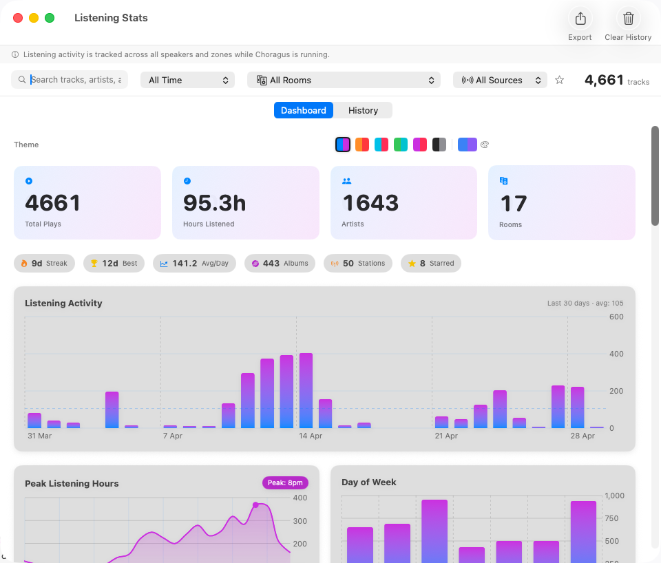

The **Dashboard** summarises listening: total plays, hours listened, unique artists and rooms. Quick stat pills show your current streak, best streak, average plays per day, unique albums, stations, and starred-track count. Charts show listening activity over time, peak hours, and day-of-week distribution.

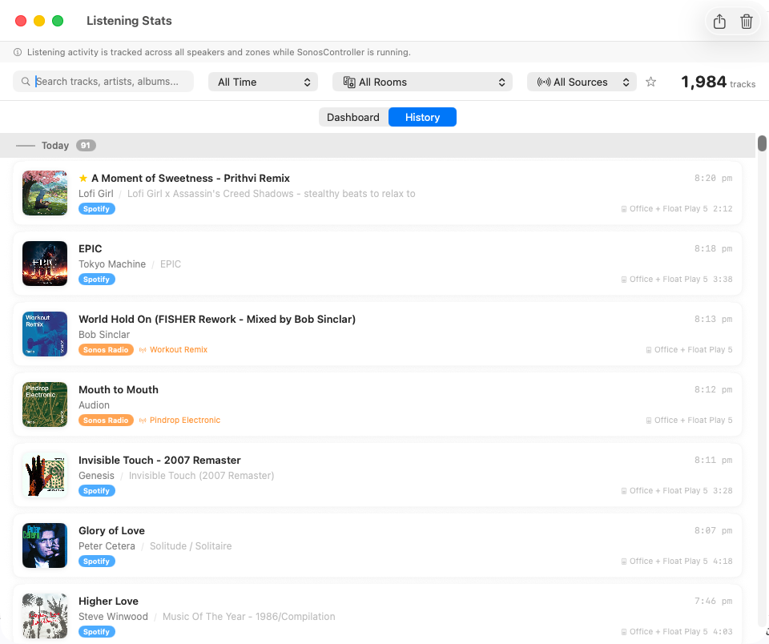

The **History** timeline groups tracks by day with album art, artist, album, service-source badge, room, and duration. Starred tracks show a star icon. Tracks from radio streams show the station name and service badge (Sonos Radio, TuneIn, etc.). Filter by date range, room, source, or search text. Starred-only filter shows just your favourites.

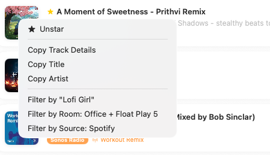

**Right-click any track** in the history to:

- **Star / Unstar** — mark tracks as favourites
- **Copy Track Details** — copies formatted metadata (Artist, Album, Track, Station) to clipboard
- **Copy Title / Copy Artist** — copy individual fields
- **Filter by artist, room, or source** — instantly filter the history view

**Last.fm scrobbling** *(v3.6)* — listening history doubles as the source for Last.fm scrobbling. Everything is submitted from the local SQLite table, not by tapping the speakers again; filter by room and music service so you can (for example) scrobble only what plays in the office, excluding the kids' bedroom. See the **Scrobbling** tab in Settings — documented in [CHANGELOG.md](CHANGELOG.md).

### Menu Bar Mode

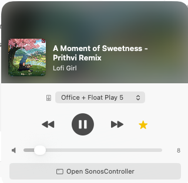

Control playback without switching apps. The menu-bar mini player shows album art with a blurred background, track title, artist, and room. Transport controls (skip, play/pause, skip), volume slider with mute toggle, and a star button for the currently playing track. The room picker shows green/grey dots for playing status across zones. Click *Open Choragus* to bring up the main window.

### Rooms & Grouping

The sidebar lists every room, grouped by Sonos system when more than one is on the network. Double-click a room to open the grouping editor. Drag one room onto another to group them, or drag a room onto the strip below the list to split its group; rooms on different systems can't be grouped.

Holding the group volume slider at zero for a second levels every speaker in the group, so raising it afterwards moves them together instead of restoring the previous spread.

### Speaker Presets

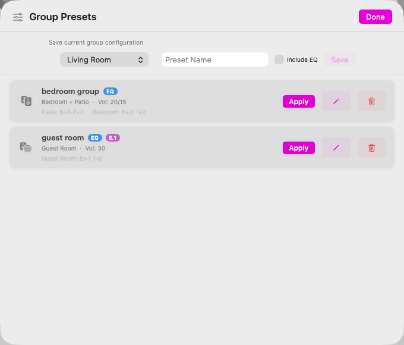

Save and recall speaker-group configurations with per-speaker volumes. Optionally include EQ settings (bass, treble, loudness, home-theatre sub/surround levels). One-click Apply to instantly reconfigure your speakers. Presets show an `EQ` badge when EQ is bundled and a `5.1` badge when the saved zone is a Home Theater bundle.

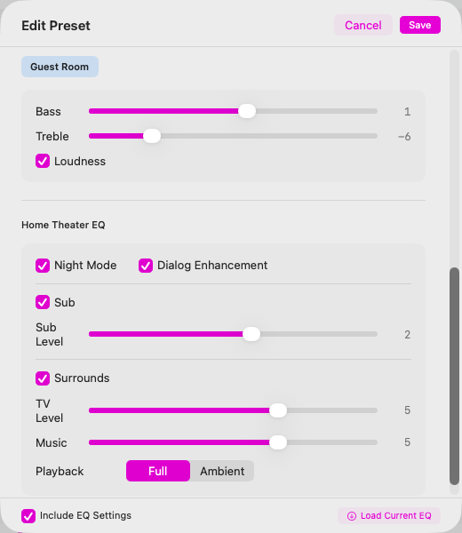

The preset editor shows all EQ controls including Home Theater settings: Night Mode, Dialog Enhancement, Sub level, Surround level, TV/Music balance, and Full/Ambient playback mode.

### Settings

Settings has four tabs: **Display**, **Music**, **Scrobbling**, and **System**. Each tab is broken into clearly labelled sections.

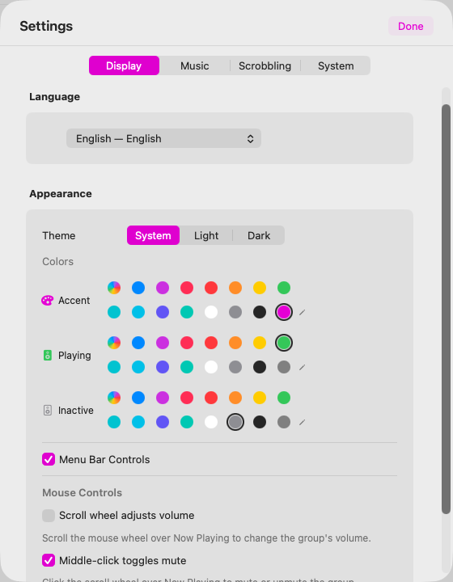

- **Display** — Language (13 supported), Theme (System / Light / Dark), Colours (separate pickers for accent dot, playing-zone indicator, and inactive-zone indicator), Menu Bar Controls toggle, Keyboard Controls (media keys on or off), Mouse Controls (scroll-wheel volume, middle-click mute), and the karaoke window's line style and appearance.

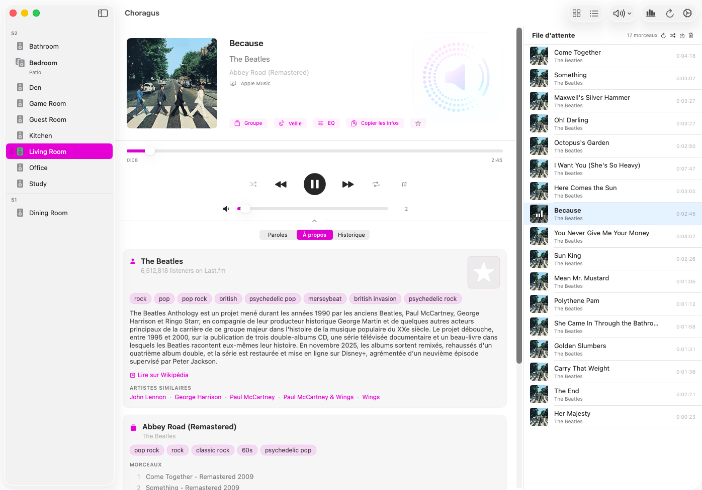
- **Music** — Connected services with status dots, search-only services as toggles, the *Other Services* section for everything else, and a Local Music Library section listing the network folders each Sonos system indexes (tagged S1 or S2) with a reindex button. Adding or removing a folder is done in the Sonos app. *(See screenshot under [Music Services](#music-services).)*
- **Scrobbling** *(v3.6)* — Send your listens to Last.fm using your own API key (register at [last.fm/api/account/create](https://www.last.fm/api/account/create)). Filter by room and by service, run automatically every 5 minutes or on demand. A Filter Preview shows why a track did or didn't scrobble.

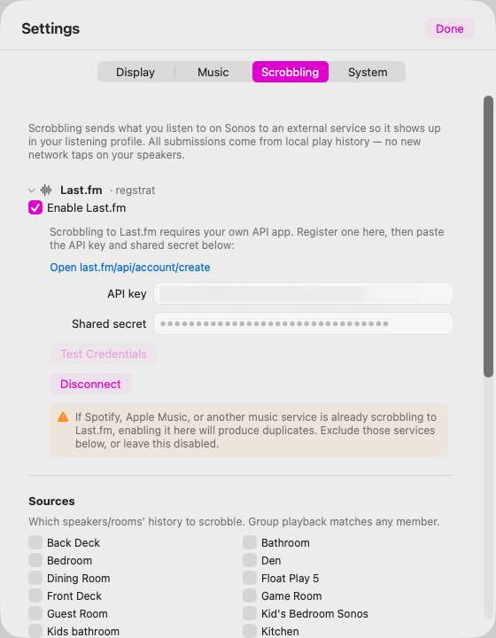

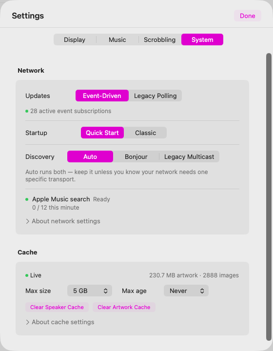

- **System** — Updates (Event-Driven push or Legacy Polling), Startup mode (Quick Start cached / Classic), **Discovery** (Auto / Bonjour / Legacy Multicast — Auto is the default and works for almost everyone), the Event listener port and Discovery hop limit for segmented networks, and the artwork Cache controls (max size, max age, clear).

### Privacy & Local-Only Operation

- **No accounts, no cloud.** The app talks directly to your speakers on your LAN.
- **No telemetry.** No analytics, no crash reporting, no usage tracking.
- **Tokens stay in Keychain.** When you connect a service like Spotify, the auth tokens live in macOS Keychain, protected so they can't be copied to another device.
- **App sandbox.** The app runs with minimal entitlements — network only. It can't read your files, contacts, or other apps.
- **All history stays on your Mac.** Listening history is a local SQLite file. You can clear it at any time from Settings.

---

## Requirements

- macOS 14.0 (Sonoma) or later
- Apple Silicon Mac (M1+) or Intel Mac
- Sonos speakers on the same local network

Building from source: see [technical_readme.md](technical_readme.md#building-from-source).

---

## Forking & home builds

A few features in the upstream binary depend on credentials and infrastructure that aren't included in the source. Self-built copies still work; those features stay inert or fall back. See **[docs/FORKS.md](docs/FORKS.md)** for what's affected and how to substitute your own.

---

## Known Limitations

- **Apple Music** — search works via the iTunes API; playback requires Apple Music connected in the Sonos app plus one favorited song.
- **Sonos Radio** — search works anonymously; browsing categories requires DeviceLink auth (not yet supported).
- **Amazon Music / YouTube Music** — blocked (they require native OAuth flows that aren't available to third-party apps).
- **Adding to Favorites** — requires the official Sonos app (the UPnP `CreateObject` action is not supported by Sonos firmware).
- **Adding music library folders** — also requires the Sonos app. Choragus lists the folders each system indexes and can trigger a reindex, but `CreateObject` on the share container returns success and stores nothing (verified on S1 and S2).
- **Alarms** — Sonos S2 uses a cloud API; the local UPnP `AlarmClock` service returns empty.

## License

PolyForm Noncommercial 1.0.0 — see [LICENSE](LICENSE). Copyright © 2024-2026 Choragus contributors. Free for personal, hobbyist, educational, charitable, and other noncommercial use; commercial use requires a separate agreement. These terms apply retroactively to every version of the software ever released under any name — including all releases previously distributed as **SonosController** (the project's former name). Any prior MIT-licensed SonosController or Choragus releases are superseded.

## Disclaimer

This project is not affiliated with, endorsed by, or connected to Sonos, Inc. or any of the music service providers referenced in this software. All trademarks are the property of their respective owners: "Sonos" and "Sonos Radio" are trademarks of Sonos, Inc.; "Spotify" is a trademark of Spotify AB; "Apple Music" and "iTunes" are trademarks of Apple Inc.; "Amazon Music" is a trademark of Amazon.com, Inc.; "YouTube Music" is a trademark of Google LLC; "TuneIn" is a trademark of TuneIn, Inc.; "TIDAL" is a trademark of Aspiro AB; "Deezer" is a trademark of Deezer SA; "SoundCloud" is a trademark of SoundCloud Limited; "iHeartRadio" is a trademark of iHeartMedia, Inc.; "Plex" is a trademark of Plex, Inc.; "Calm Radio" is a trademark of Calm Radio Ltd.

This software is an independent, fan-built controller that communicates with Sonos hardware using standard UPnP protocols. No proprietary code, assets, or intellectual property from any of these companies was used. Use at your own risk.
