# AI in Choragus

Choragus is a Sonos controller first. Every part of it — browsing, queues, grouping, alarms, presets, listening history — works with no AI at all, no account and no key.

On top of that sit four optional levels. Each one is a step further, and each is independent: you can stop at any of them, and you can turn any of them off again without losing anything.

| Level | What you get | What you need | Setup |
|---|---|---|---|
| **0. None** | The whole app | Nothing | — |
| **1. Copy-and-paste playlists** | Describe a playlist, paste the reply back, Choragus finds the real tracks | Any chat AI you already use, in a browser or another app | [Level 1](#level-1--copy-and-paste-playlists) |
| **2. Connected playlist building** | The same, without the copying: Choragus asks the model itself | An API key, or a model running on your own machine | [Level 2](#level-2--connected-playlist-building) |
| **3. An assistant drives Choragus** | Ask an assistant on your Mac to play, group, queue, build, tidy — 116 tools | Claude Desktop, Claude Code, Cursor, Codex or similar | [Level 3](#level-3--an-assistant-drives-choragus-mcp) |
| **4. The same from your phone** | Those tools from anywhere, with nothing exposed to the internet | Level 3, plus Claude Code Remote Control or Codex | [Level 4](#level-4--the-same-from-your-phone) |

<picture>
  <source media="(prefers-color-scheme: dark)" srcset="diagrams/ai-levels-dark.png">
  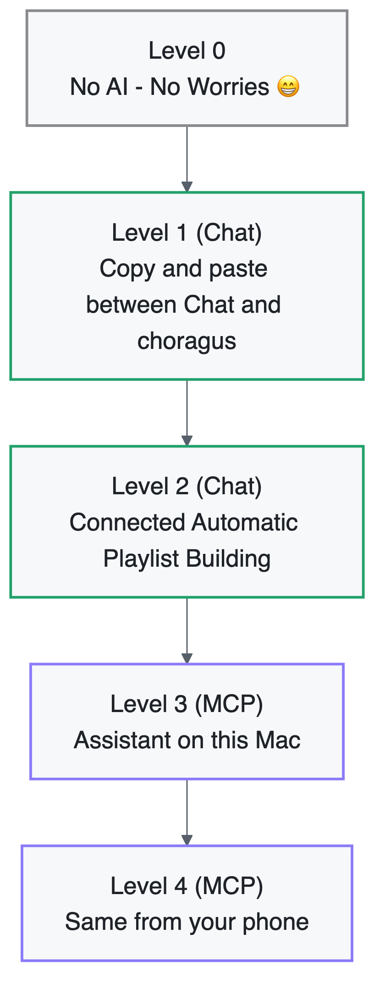
</picture>

---

## Level 0 — no AI

Nothing to set up. Settings → AI → AI playlist generation stays off, Agent access stays off, and the Build Playlist entry stays out of Browse. Everything else in the app is unaffected.

---

## Level 1 — copy-and-paste playlists

Choragus writes the request; you carry it to whatever chat AI you already have open — Claude, ChatGPT, Gemini, a local model, anything that answers in text — and carry the reply back. No key, no account, no charge beyond whatever you already pay that service.

<picture>
  <source media="(prefers-color-scheme: dark)" srcset="diagrams/level1-copy-paste-dark.png">
  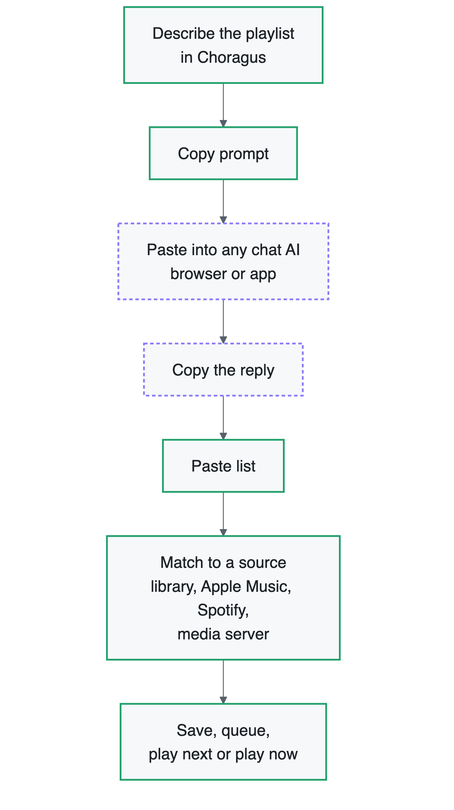
</picture>

**Setup**

1. Settings (⌘+,) → **AI** → switch on **Enable AI playlist generation**.
2. Browse → **Choragus Sources** → **Build Playlist with AI**.
3. Under **Generate with**, choose **Manual (copy prompt)**.

**Using it**

1. Type what you want: *"90s trip-hop for a rainy evening, nothing over five minutes"*.
2. **Copy prompt** puts a ready-made request on the clipboard, including the catalogue hint for whichever source you plan to match on.
3. Paste it into your chat AI, then copy the reply.
4. **Paste list** reads it back. The same button accepts any list you write yourself, one song per line, `Title - Artist`.
5. **Match to** resolves each line to a real, playable track. Misses are listed so you can try them somewhere else.
6. Deliver: a Choragus playlist (with a folder picker), the end of the queue, play next, or play now.

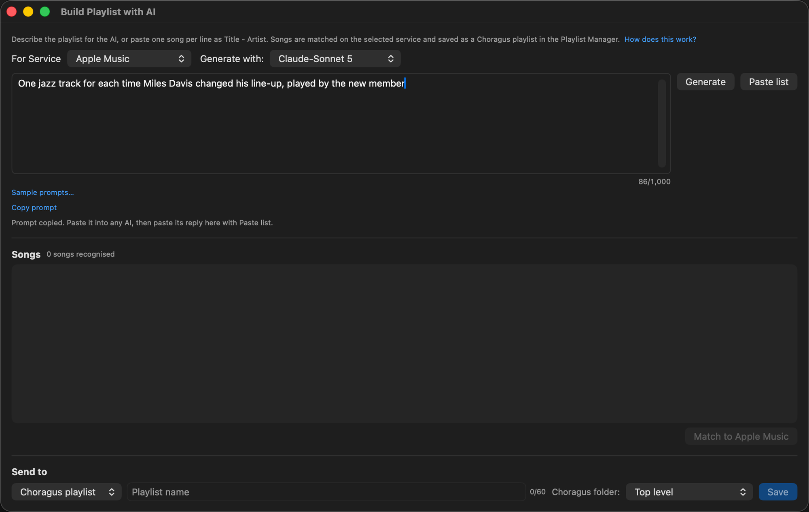

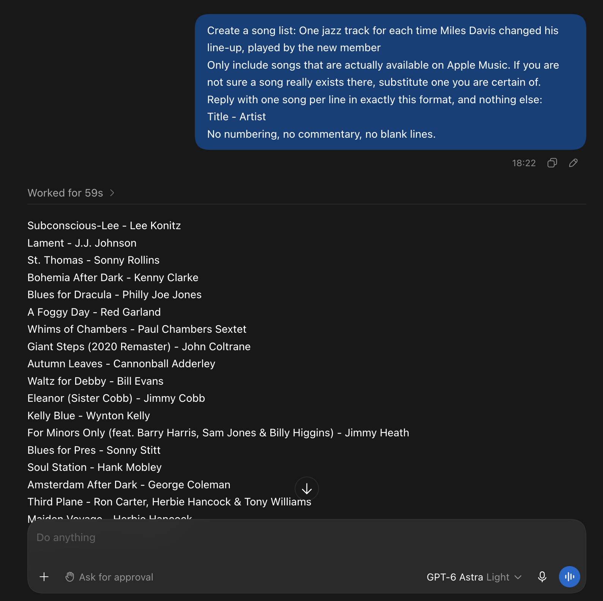

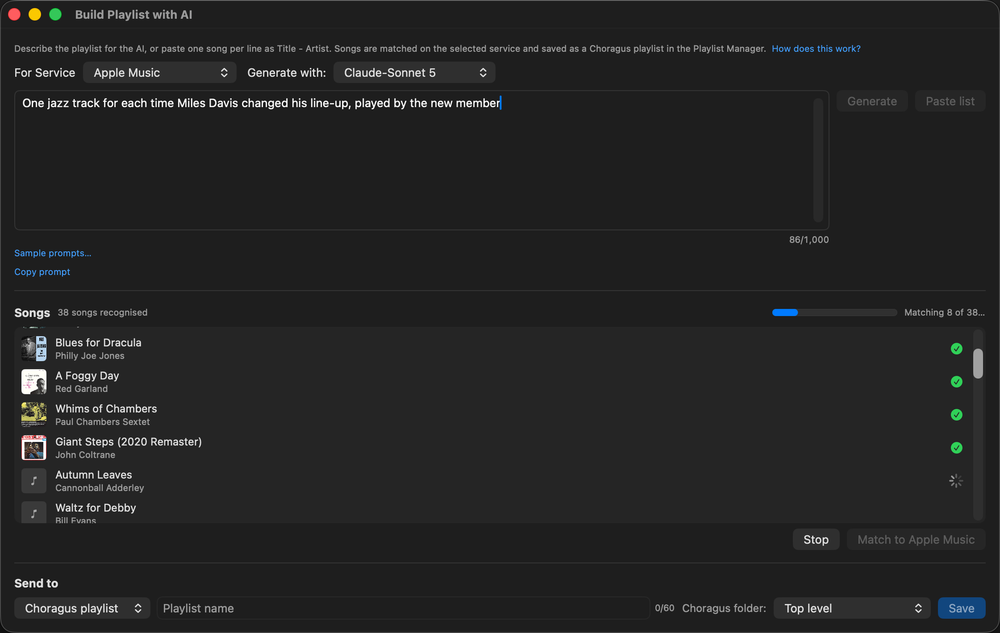

**What leaves your Mac:** only what you paste yourself, into a service you chose. Choragus sends nothing.

---

## Level 2 — connected playlist building

The same window, without the round trip: Choragus calls the model directly and the songs stream into the table as it writes them.

<picture>
  <source media="(prefers-color-scheme: dark)" srcset="diagrams/level2-connected-dark.png">
  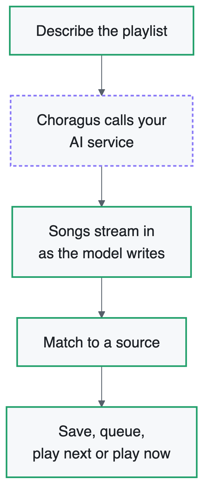
</picture>

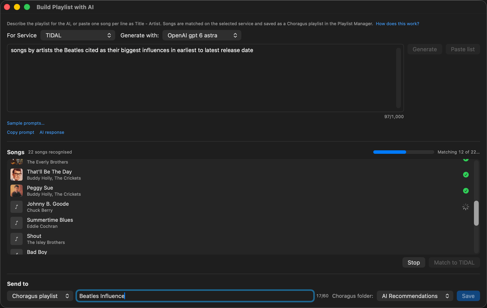

**Setup**

1. Settings (⌘+,) → **AI** → **AI playlist generation** → switch it on.
2. **Add** a service and name it, e.g. *Claude* or *Studio LM*.
3. Choose the provider:
   - **Claude** — an [Anthropic API key](https://console.anthropic.com/).
   - **OpenAI** — an [OpenAI API key](https://platform.openai.com/api-keys).
   - **Custom (OpenAI-compatible)** — a base URL for DeepSeek, Ollama, LM Studio, vLLM or anything else that speaks the OpenAI chat API. A bare host gains `/v1` automatically.
4. Paste the key. It goes straight into the macOS keychain and is only ever sent to that provider's own host.
5. Pick a model — the list is fetched from the provider itself — and press **Test**.

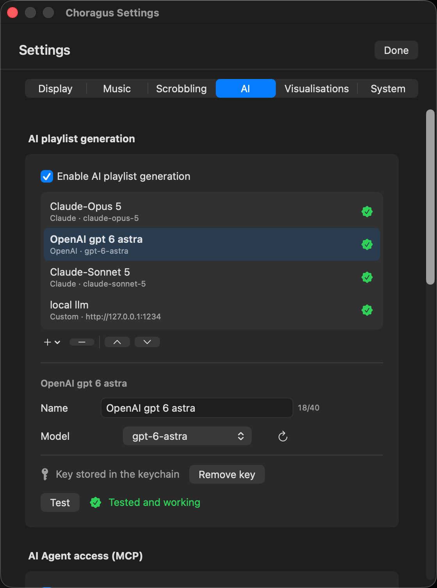

**Notes**

- Several services can be configured; the Build Playlist window's **Generate with** menu picks between them, and **Manual (copy prompt)** from Level 1 stays available.
- A local model (Ollama, LM Studio) keeps the whole thing on your machine. Cleartext to a non-local address is refused.
- The reply is treated as untrusted text end to end: typed decoding, control characters stripped, field and list caps.
- Niche briefs make every model invent songs. Choragus tells the model to substitute anything it is unsure of, and the matcher only keeps tracks that really exist on the source you chose — so a wildly obscure request comes back with misses rather than fiction.

**What leaves your Mac:** the brief you typed and the model's reply, to the provider you configured, with your key.

---

## Level 3 — an assistant drives Choragus (MCP)

Choragus runs a **local Model Context Protocol server** on `127.0.0.1`. An AI assistant on the same Mac connects to it and gets 116 tools over the same code the app itself uses — everything the app can do short of changing its own settings.

Crucially, the assistant reaches **your local library and media servers** as well as the **cloud services signed in to Sonos**. "Play the Miles Davis from my own library, and use Apple Music only if I don't have it" is a request it can actually carry out.

<picture>
  <source media="(prefers-color-scheme: dark)" srcset="diagrams/level3-mcp-dark.png">
  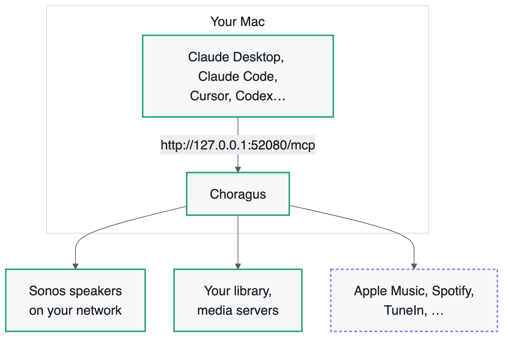
</picture>

**Setup**

1. Settings (⌘+,) → **AI** → **AI Agent access (MCP)** → switch on **Enable MCP server**.
2. Type a name for the assistant, pick its access level, and click **Add token**. The token is copied to the clipboard; paste it into the client now, because Settings shows only its first characters afterwards.
   - **Read only** — rooms, now playing, queue, library, history. Look, don't touch.
   - **Control** — read, plus playback, volume, queue, grouping, presets.
   - **Manage** — control, plus playlists, presets, alarms and the library index.
3. Connect the client. Claude Code is one command:
   ```bash
   claude mcp add --transport http choragus http://127.0.0.1:52080/mcp \
     --header "Authorization: Bearer <token>"
   ```
   Cursor and VS Code take the same endpoint directly; Claude Desktop and the OpenAI tools reach it through the `mcp-remote` bridge. [docs/MCP.md](MCP.md#connecting-a-client) has each configuration.
4. Keep Choragus running: **Open Choragus at login** and **Prevent the Mac from sleeping** are in the same section.
5. Ask the assistant *"what rooms do I have?"* — it should list your Sonos rooms.

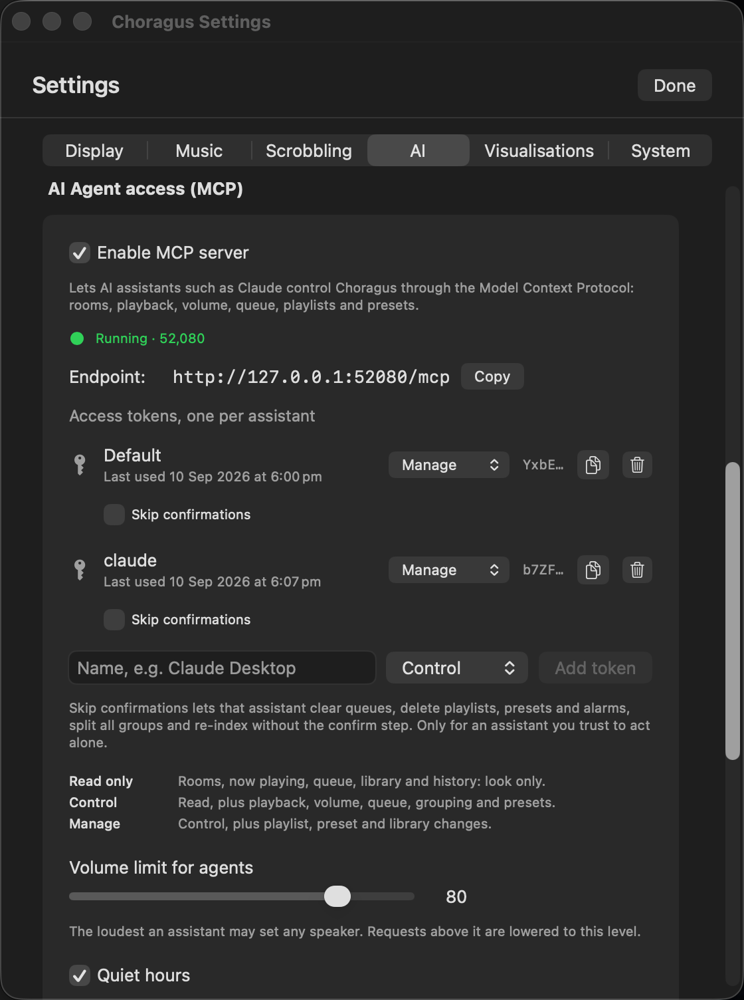

**Things to say**

- *"What's playing in the kitchen?"*
- *"Turn the office down to 20 and skip this track."*
- *"Play Kind of Blue in the living room — from my library if you have it, otherwise Apple Music."*
- *"Put the whole house on the kitchen, then put it back the way it was."*
- *"Make me a 90s indie playlist from my own music and start it on the deck."*
- *"Turn the bass up two in the master bedroom."*
- *"Wake me at 6:30 on weekdays in the bedroom with the chime at volume 15."*
- *"What have I listened to most this month?"*

**Watching it work**

An **MCP** badge sits next to Settings in the toolbar whenever the server is on, with a light in its state — green running, orange failed, grey stopped. Clicking it opens Diagnostics → **AI Agent access**, which lists every request by token, action, outcome and duration, and shows the full arguments and result of whichever row you select.


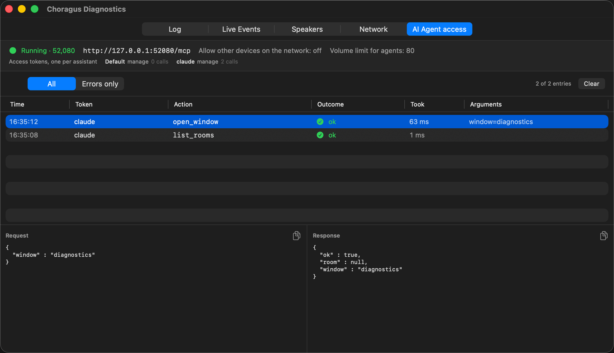

**Safety, briefly** — the server is loopback-only unless you allow other devices, every request carries a token compared in constant time, tokens live in the keychain, web pages and unknown host names are refused, five wrong tokens lock an address out, each token is rate-limited, a volume limit and optional quiet hours cap what any assistant can do to the volume, and anything that removes what cannot be put back asks the assistant to confirm first. [docs/MCP.md](MCP.md#network-and-security) has the full account.

---

## Level 4 — the same from your phone

Nothing is published to the internet. Instead, your phone drives a session that is *running on the Mac*, and that session makes the loopback call.

<picture>
  <source media="(prefers-color-scheme: dark)" srcset="diagrams/level4-phone-dark.png">
  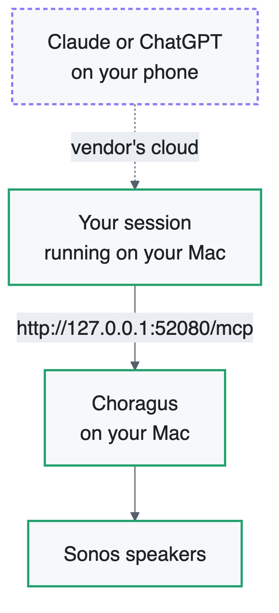
</picture>

**With Claude — Remote Control**

1. On the Mac, in the folder of your choice:
   ```bash
   claude --remote-control "Choragus"
   ```
   Or `/remote-control` from inside a session you already have open. There is a one-time confirmation.
2. On the phone, open the Claude app, tap **Code**, and pick the session by name. It shows a computer icon with a green dot while it is online.
3. Ask for music. The tools run on the Mac, so `choragus` answers exactly as it does at your desk.

Requires a Pro, Max, Team or Enterprise plan, signed in with `/login` rather than an API key. On Team and Enterprise an Owner enables Remote Control first. See [Anthropic's Remote Control docs](https://code.claude.com/docs/en/remote-control).

**With ChatGPT — Codex**

Send the request to a Codex task backed by your Mac. Same shape: the phone is a remote control, the Mac makes the MCP call.

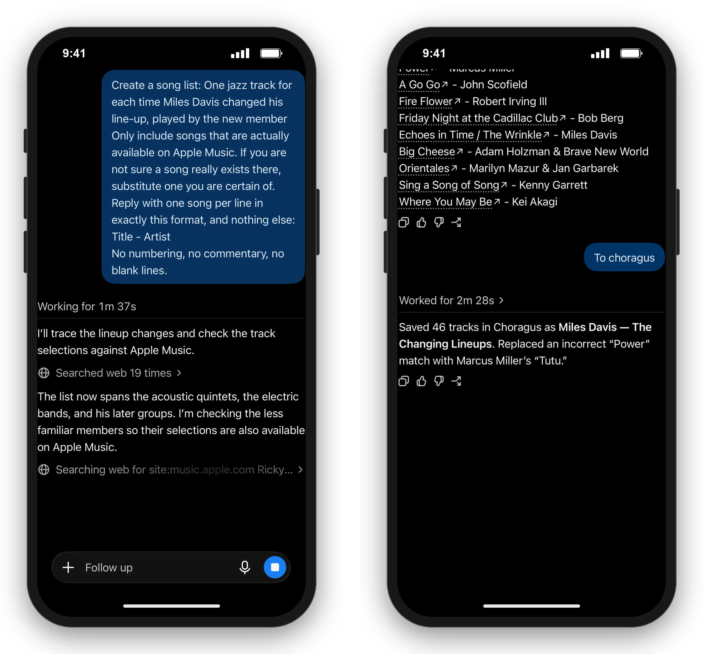

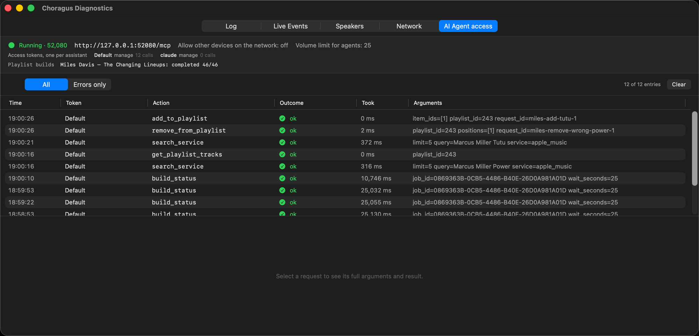

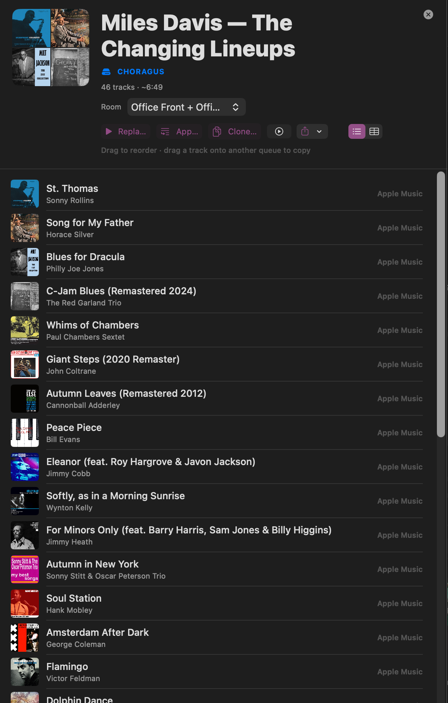

**Why not add Choragus as a connector in the phone app?**

A connector runs in the cloud, so Choragus would need a public HTTPS address. Claude connectors also expect OAuth 2.1, and ChatGPT custom MCP is limited to Developer Mode on business plans. That means a tunnel, a certificate, an OAuth server, and your speakers reachable from the internet. A session on the Mac gives the same result with none of that.

**Two settings**

- Leave **Allow other devices on the network** off. The phone route does not use it, and switching it on sends your token over the LAN unencrypted.
- Keep the Mac awake: **Prevent the Mac from sleeping** and **Open Choragus at login**, both in Settings (⌘+,) → AI → AI Agent access. A sleeping Mac takes the session offline.

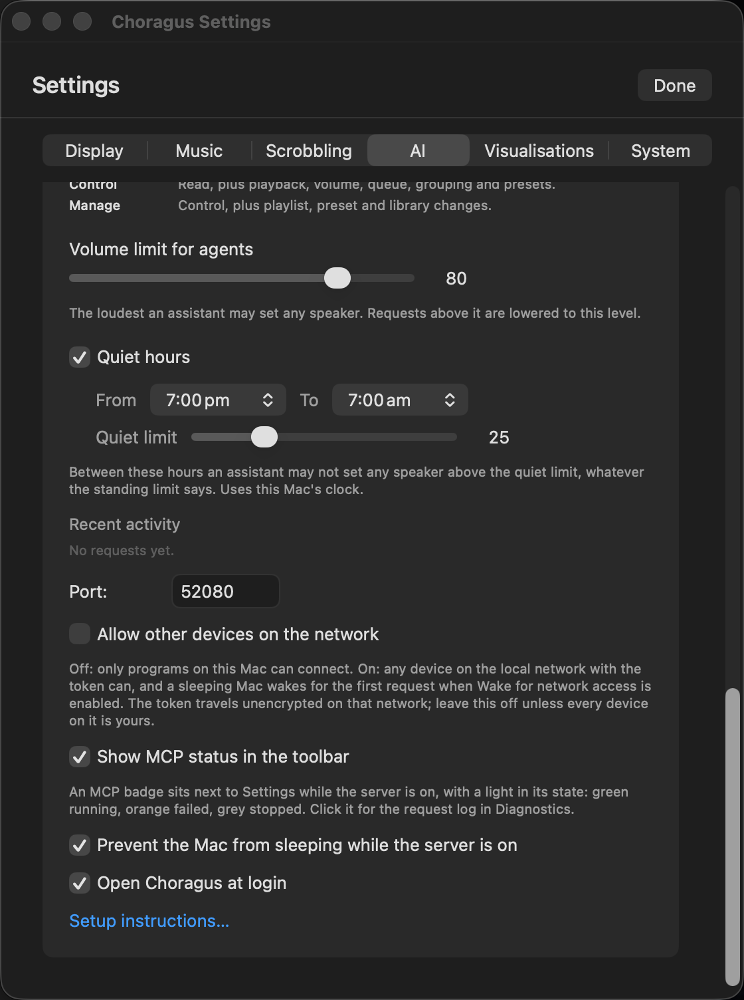


---

## Which level suits you

- **You just want a controller.** Level 0.
- **You already chat with an AI and don't want another key.** Level 1.
- **You build playlists often.** Level 2.
- **You'd rather ask than click.** Level 3.
- **You want that from the sofa or the car.** Level 4.

## What each level sends where

| Level | Leaves your Mac |
|---|---|
| 0 | Nothing |
| 1 | Only what you paste yourself, into a service you chose |
| 2 | The brief and the reply, to your configured provider, with your key |
| 3 | Nothing to Choragus's own network; the assistant sees the room, track and playlist names it asks for |
| 4 | As Level 3, plus your messages passing through the cloud on their way to the assistant, as they already do |

Choragus itself has no cloud, no account and no telemetry at any level.

## Troubleshooting

- **The assistant can't see the tools.** Tools load when a client session starts. Restart the client after adding the server. In Claude Code, `claude mcp get choragus` should say Connected.
- **"Choragus is still starting".** The app was launched but has not finished discovery. Wait a moment, or open the main window once.
- **A call is refused with an access level message.** The token is read only or control; raise it in Settings → AI → AI Agent access.
- **A destructive call needs `confirm`.** By design. Turn on **Skip confirmations** for that token if you trust the assistant to act alone.
- **Everything stops when the lid closes.** Prevent the Mac from sleeping, in the same section.
- **You can't find the token.** Only its first characters are shown after creation. Copy it again from the row, or revoke it and add a new one.
- **Something behaved oddly.** The MCP badge in the toolbar opens Diagnostics → AI Agent access, where every request and its full payload is listed.

## See also

- [docs/MCP.md](MCP.md) — every tool, each client's configuration, the protocol and security details.
- [Setupguide.md](../Setupguide.md) — getting music services connected in the first place.
- Help → **AI** in the app: **AI Playlists** and **AI Agent access**, in all 13 languages.
