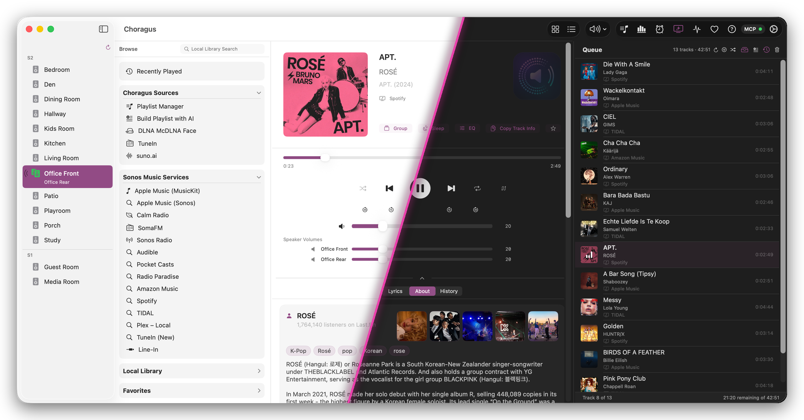
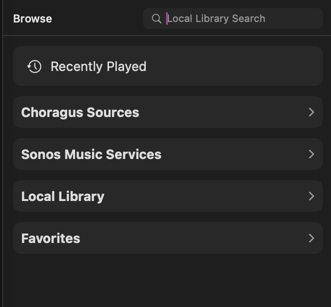
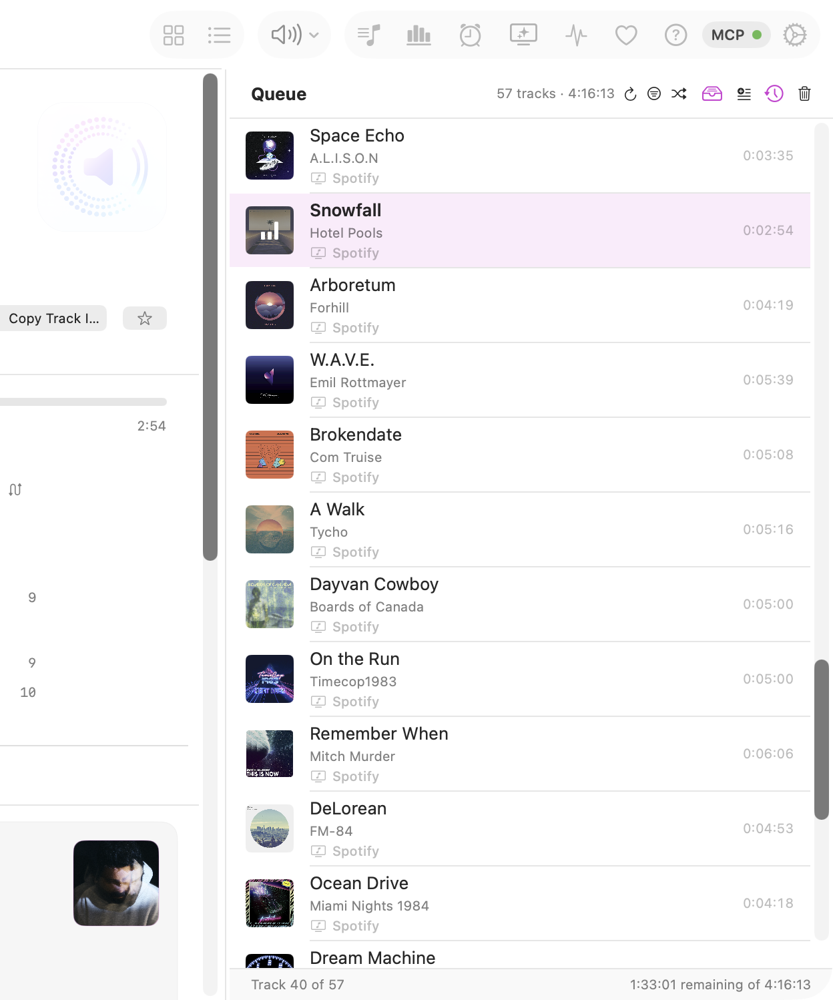
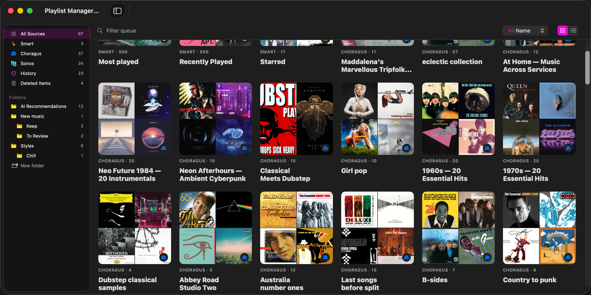
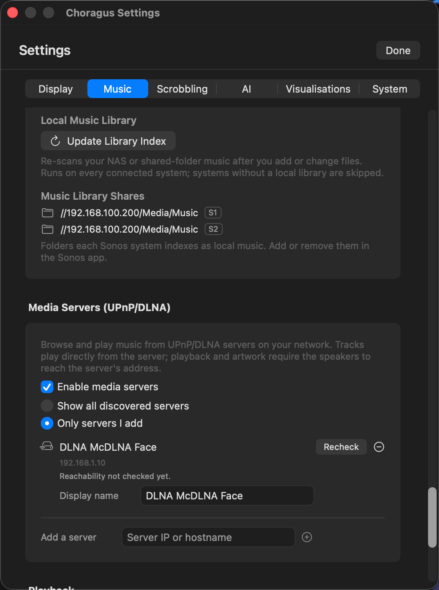

# Choragus feature reference

Everything the app does, area by area. The [README](../README.md) carries the v5.0 highlights; this page is the long form and stays current with each release.

---


### The Toolbar


Left to right, above the panels:

| Icon | What it does |
|---|---|
| Grid | Show or hide the Browse panel |
| List | Show or hide the Queue panel |
| Speaker | Pause all, resume all, mute all, and the preset menu |
| Music list | Playlist Manager (`⌘L`) |
| Bar chart | Listening Stats (`⇧⌘S`) |
| Alarm clock | Sonos alarms (`⇧⌘A`) |
| Sparkles over a screen | Visualisation — Karaoke (`⌘K`) and Back of the Club (`⌘J`) |
| Activity trace | Diagnostics |
| Heart | Ways to support the project — official builds only |
| Question mark | Help (`⌘?`) |
| Gear | Settings (`⌘,`) |


### Now Playing, Browse, and Queue



The main view shows three panels: **Browse** (left), **Now Playing** (centre), and **Queue** (right). All three are togglable from the toolbar. The Now Playing panel is guaranteed a minimum width of 640 px — the side panels shrink proportionally when the window is resized.

**Now Playing** shows album art with automatic artwork resolution from multiple sources (speaker metadata, media-server art, iTunes Search, manual override). Click the artwork to open it full size and page through the artist's photos; right-click to search for alternative art, ignore incorrect art, or refresh. The service tag names the source: Spotify, Radio, Music Library, your media server, and so on.

**Star any track** — click the star icon next to Copy Track Info to star the currently playing track. Works for any source: queue tracks, radio streams, Spotify, Apple Music — any track where metadata is available. Starred tracks are saved locally and can be filtered in the listening history. Star and unstar from Now Playing or the menu-bar mini player.

**Copy Track Details** copies the current track's metadata to the clipboard in a clean format:

```
Artist: Lofi Girl
Album: Lofi Girl x Assassin's Creed Shadows - stealthy beats to relax to
Track: A Moment of Sweetness - Prithvi Remix
```

Useful for sharing, logging, or searching another platform.

**Playback controls** — play, pause, stop, skip, seek with a draggable slider and smooth position interpolation. Shuffle, repeat (off / all / one), crossfade, sleep timer. Pause-all / Resume-all from the toolbar menu.

**Stream details** sit above the service name: a **Dolby Atmos** badge when the speaker reports a spatial stream and the coordinator supports it, the **TV input format** for HDMI sources (Dolby Digital 5.1, Atmos TrueHD 7.1, DTS and so on), and otherwise the container with bit depth and sample rate — `FLAC · Lossless · 24-bit/96 kHz`. Nothing is shown when the speaker reports no detail, which is common on services that don't publish it. The Back of the Club wall shows the same line above the source name.

For a home-theatre zone, **Night Mode** and **Dialog Enhancement** appear directly below the group buttons. The full set of home-theatre settings stays in the EQ window.


**Lyrics, About, and History** sit in tabs below the transport controls. Lyrics are fetched per track and scroll in time with playback when timed lyrics exist, or display as plain text when they don't. About pulls the artist biography, listener count, and tags from Last.fm. History lists previous plays of the current track.


**Volume** — master slider covers the whole group (proportional or linear mode). Individual per-speaker sliders with drag protection. Mute toggle per speaker and master. Bass, treble, loudness, and Home Theater EQ (sub/surround levels, night mode, dialog enhancement) via the EQ panel.

**Scroll-wheel + middle-click** — hover over the Now Playing view and scroll the mouse wheel to adjust the master volume of the selected speaker, following the system's scrolling direction. Middle-click anywhere on the view toggles mute. Discrete steps, debounced so rapid flicks don't spam the speaker with SOAP calls.

### Browse & Library

The Browse panel reaches your music library and connected services:

- **Service Search** — Apple Music, TuneIn, Calm Radio, Sonos Radio, Spotify, Plex (individually toggleable in Settings)
- **Sonos Favorites & Playlists** — everything you've set up in the Sonos app
- **Local Library** — NAS/network music library with artists, albums, tracks, genres, composers, folder browsing
- **Media Servers** — DLNA/UPnP servers on your network (Plex Media Server, Synology, MinimServer and others), browsed with their own artwork; the speaker plays the server's stream directly
- **Choragus Sources** — Playlist Manager, Build Playlist (AI), TuneIn via the public RadioTime API, Suno
- **Recently Played** — quick access to tracks from your listening history
- **Search** — local library search across artists, albums, and tracks
- Play now, play next, add to queue, replace queue from the context menu
- Drag tracks from Browse directly into the Queue

The sidebar sections are cards: collapse any of them, and drag them into your own order.



Sidebar sections are cards: collapse the ones you don't use and drag them into your own order.

#### Build Playlist with AI

Describe the playlist you want — "90s trip-hop for a rainy evening, nothing over 5 minutes" — and the songs stream into a table as the model writes them. **Match to** the service you pick (Apple Music, an authenticated streaming service, your local library or a media server) resolves each one to a playable track, then save it as a Choragus playlist, add it to the queue, play it next or play it now. No AI service configured? **Copy prompt** gives you a template for any chat AI and **Paste list** reads the reply back.

AI services live in Settings → AI: add Claude, OpenAI, or any OpenAI-compatible endpoint (DeepSeek, Ollama, LM Studio), give each a name, store its key in the keychain and press Test; the model list comes from the provider itself. Help → AI Playlists walks through it and lists sample prompts.


### Queue

The Queue panel shows the current play queue with album art, track info, and duration; the header shows the queue's running time and the footer shows the playing position and the time left. Double-click to play a track; click to select, ⌘-click and ⇧-click to select several, then drag, right-click or press Delete to move, copy or remove them together. Queue shuffle physically reorders the tracks. Save the current queue as a Sonos playlist, an Apple Music playlist when every track is an Apple Music one, or into Choragus's own Playlist Manager.

The queue is checked after each track change: rows whose service links have expired, whose media server cannot be reached, or which were queued without metadata are greyed out with a badge that says why, repaired in place where the original service item is known, and removable in one click otherwise.



As tracks change the view follows the speaker: the previous track stays at the top so the playing track sits just below it, and the queue scrolls on toward the end when too few tracks remain to slide.

### Playlist Manager



A separate window (`⌘L`, also under Browse → Choragus Sources) holding saved queues, split by source in the sidebar: **Choragus** queues stored on this Mac, **Sonos** playlists read from the system, **History** snapshots taken automatically, and **Smart** queues (Most Played over the last 30 days, Recently Played, Starred).

Queues can be filed into folders and subfolders, and the same queue can sit in more than one folder. Switch between an artwork grid and a list, sort by name or newest, filter by title, then select a queue to see its tracks and running time, choose which room to play into, reorder by dragging, or drag a track onto another queue to copy it there. Export a queue as M3U or CSV, duplicate it, or clone it into a Choragus queue; the clone can be edited while the original Sonos playlist stays unchanged.

The same folders appear wherever a playlist is picked: Add to Choragus Queue in any context menu and the queue panel's load menu open by folder, with a History entry for the automatic snapshots. Deleting a playlist moves it to **Deleted Items**, where it can be restored for 30 days before it is removed for good.


### Music Services



Services are managed in **Settings → Music**. Each can be individually enabled. **First-time setup is described in plain language in [Setupguide.md](../Setupguide.md)** — start there if you're not sure how to get a service showing up.

#### Available — No Connection Required

| Service | Browse | Search | Playback | Notes |
|---------|:------:|:------:|:--------:|-------|
| **Local Music Library** | ✓ | ✓ | ✓ | NAS / network shares via UPnP |
| **Sonos Favorites** | ✓ | — | ✓ | Favorites set up in the Sonos app |
| **Sonos Playlists** | ✓ | — | ✓ | Playlists saved from queues |
| **TuneIn** | ✓ | ✓ | ✓ | Public RadioTime API, no login needed |
| **Calm Radio** | ✓ | — | ✓ | Public API, no login needed |
| **Apple Music** | — | ✓ | ✓ | Search via iTunes API. Playback requires Apple Music connected in the Sonos app and one favorited song — this lets the app discover your account credentials. Once set up, all search results are directly playable |
| **Sonos Radio** | — | ✓ | ✓ | Search via anonymous SMAPI. Category browsing requires DeviceLink auth, which Choragus does not implement |

#### Available — Connection Required (Tested)

| Service | Browse | Search | Playback | Notes |
|---------|:------:|:------:|:--------:|-------|
| **Spotify** | ✓ | ✓ | ✓ | AppLink authentication. Connect in Settings, then add one favorited song via the Sonos app |
| **Plex – Local** | ✓ | ✓ | ✓ | PIN sign-in at plex.tv, then a direct connection to your Plex Media Server on the network. Plays count on the server and the room shows as an active stream |
| **Plex – Remote** | ✓ | ✓ | ✓ | Sonos's own Plex service, reached through Plex's servers. Lists your server only when Plex Remote Access has a direct public address; a relay-only server (CGNAT) shows as unavailable |
| **Audible** | ✓ | ✓ | ✓ | AppLink authentication. Confirmed working for audiobook playback; chapter navigation behaves like a queue |
| **Amazon Music** | ✓ | ✓ | ✓ | AppLink authentication. On S1 tracks enqueue individually; on S2 albums, playlists and artists play whole, as the Sonos app plays them. Amazon Music Prime is station playback only; single tracks need Amazon Music Unlimited |

#### Available — Connection Required (Untested)

40+ additional services are available via SMAPI AppLink/DeviceLink and may work — connect via **Settings → Music → Other Services**. Results are not guaranteed.

| Service | SID | Notes |
|---------|:---:|-------|
| **Pandora** | 3 | US-only as of 2026. Sign-in is confirmed to work; playback is untested. Connect and please [open an issue](https://github.com/scottwaters/Choragus/issues) with the result |

#### Not Available

Confirmed by live probe against the Sonos `ListAvailableServices` + `getAppLink` endpoints (2026-04-24). These services ship encrypted API keys in their Sonos manifest (`cf.ws.sonos.com/p/m/<uuid>`) that only Sonos's app and speaker firmware can decrypt — third-party clients receive `403 / NOT_AUTHORIZED` from the SMAPI endpoint before auth can begin.

| Service | SID | Response | Workaround |
|---------|:---:|----------|------------|
| **Apple Music** (as SMAPI service) | 204 | `SonosError 999` | iTunes Search API fallback already used for search |
| **YouTube Music** | 284 | GCP `403 PERMISSION_DENIED` (no API key) | — |
| **SoundCloud** | 160 | `Client.NOT_AUTHORIZED` (403) | Scrobbling of SoundCloud listens via the Sonos app works |
| **Sonos Radio browsing** | 303 | Category browsing requires DeviceLink (search works) | — |

**Scrobbling remains possible for all services above** — play history is recorded from whatever the Sonos app plays, regardless of whether this app can directly browse/search that service.

### Listening History


The **Dashboard** summarises listening: total plays, hours listened, unique artists and rooms. Quick stat pills show your current streak, best streak, average plays per day, unique albums, stations, and starred-track count. Charts show listening activity over time, peak hours, and day-of-week distribution.


The **History** timeline groups tracks by day with album art, artist, album, service-source badge, room, and duration. Starred tracks show a star icon. Tracks from radio streams show the station name and service badge (Sonos Radio, TuneIn, etc.). Filter by date range, room, source, or search text. Starred-only filter shows just your favourites.


**Right-click any track** in the history to:

- **Star / Unstar** — mark tracks as favourites
- **Copy Track Details** — copies formatted metadata (Artist, Album, Track, Station) to clipboard
- **Copy Title / Copy Artist** — copy individual fields
- **Filter by artist, room, or source** — instantly filter the history view

**Last.fm scrobbling** — listening history doubles as the source for Last.fm scrobbling. Everything is submitted from the local SQLite table, not by tapping the speakers again; filter by room and music service so you can (for example) scrobble only what plays in the office, excluding the kids' bedroom. See the **Scrobbling** tab in Settings — documented in [CHANGELOG.md](../CHANGELOG.md).

### Menu Bar Mode


Control playback without switching apps. The menu-bar mini player shows album art with a blurred background, track title, artist, and room. Transport controls (skip, play/pause, skip), volume slider with mute toggle, and a star button for the currently playing track. The room picker shows green/grey dots for playing status across zones. Click *Open Choragus* to bring up the main window.

### Apple Shortcuts

Choragus actions appear in the Shortcuts app, Spotlight and Siri: Play, Pause, Toggle Play/Pause, Next Track, Previous Track, Set Volume, Activate Preset and Select Input. Each takes a room read from your Sonos system. [SHORTCUTS.md](SHORTCUTS.md) lists the actions, the Siri phrases, and how to run an action on a schedule with a Shortcuts automation or a launchd agent.

### Rooms & Grouping

The sidebar lists every room, grouped by Sonos system when more than one is on the network. Double-click a room to open the grouping editor. Drag one room onto another to group them, or drag a room onto the strip below the list to split its group; rooms on different systems can't be grouped.

Holding the group volume slider at zero for a second levels every speaker in the group, so raising it afterwards moves them together instead of restoring the previous spread.

### Speaker Presets


Save and recall speaker-group configurations with per-speaker volumes. Optionally include EQ settings (bass, treble, loudness, home-theatre sub/surround levels). One-click Apply to instantly reconfigure your speakers. Presets show an `EQ` badge when EQ is bundled and a `5.1` badge when the saved zone is a Home Theater bundle.


The preset editor shows all EQ controls including Home Theater settings: Night Mode, Dialog Enhancement, Sub level, Surround level, TV/Music balance, and Full/Ambient playback mode.

### Settings

Settings has seven tabs: **Display**, **Music**, **Scrobbling**, **AI**, **Visualisations**, **System**, and **Software Updates**. Each tab is broken into clearly labelled sections.


- **Display** — Language (13 supported), Theme (System / Light / Dark), Colours (separate pickers for accent dot, playing-zone indicator, and inactive-zone indicator), Menu Bar Controls toggle, Keyboard Controls (media keys on or off), Mouse Controls (scroll-wheel volume, middle-click mute), and the karaoke window's line style and appearance.


- **Music** — Connected services with status dots, search-only services as toggles, the *Other Services* section for everything else, a Local Music Library section listing the network folders each Sonos system indexes (tagged S1 or S2) with a reindex button, and a Media Servers section (enable, discovered or manual, add by address, per-speaker reachability). Adding or removing a Sonos library folder is done in the Sonos app. *(See screenshot under [Music Services](#music-services).)*
- **AI** — The AI services the Playlist Builder can generate with: add, name, order and test them; the model picker lists what the provider offers; keys stay in the keychain. AI Agent access (MCP): enable the server, copy its endpoint, add a named token per assistant with an access level and an optional skip-confirmations switch, set the volume limit and quiet hours, review recent activity, allow other devices, keep the Mac awake, open at login.


- **Visualisations** — Back of the Club and karaoke settings.
- **Scrobbling** — Send your listens to Last.fm using your own API key (register at [last.fm/api/account/create](https://www.last.fm/api/account/create)). Filter by room and by service, run automatically every 5 minutes or on demand. A Filter Preview shows why a track did or didn't scrobble.


**Diagnostics** — the Diagnostics window records what the app and your speakers are doing, and keeps warnings and errors so a bug report carries evidence rather than a description from memory. [DIAGNOSTICS.md](DIAGNOSTICS.md) explains what each category of message means and which ones are worth acting on. Nothing leaves your machine unless you export a bug bundle, and addresses, speaker ids, paths, account names and tokens are removed when you do.

- **System** — Updates (Event-Driven push or Legacy Polling), Startup mode (Quick Start cached / Classic), **Discovery** (Auto / Bonjour / Legacy Multicast — Auto is the default and works for almost everyone), an Advanced network row holding the event listener port, discovery hop limit and add-speakers-by-address for networks that block the automatic search, and the artwork Cache controls (max size, max age, clear).
- **Software Updates** — Update channel and check-now.

